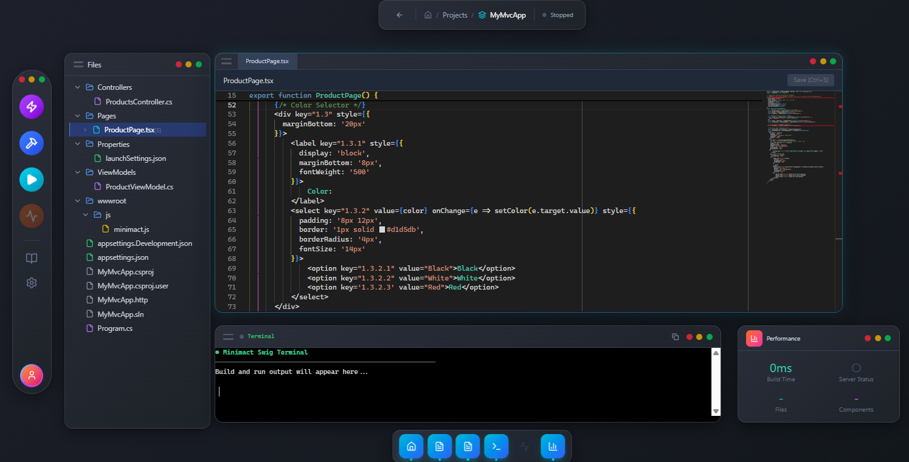

<p align="center">
  
</p>

<h1 align="center">Minimact</h1>
<h2 align="center">The Posthydrationist Framework</h2>

<p align="center">
  <strong>Server-first React with zero hydration, predictive patches, and Rust-powered performance for ASP.NET Core.</strong>
</p>

<p align="center">
  <em>The cactus doesn't hydrate — it stores.</em> 🌵
</p>


<p align="center">
  <a href="https://docs.minimact.com"></a>
  <a href="https://app.netlify.com/sites/minimact/deploys"></a>
  <a href="https://opensource.org/licenses/MIT"></a>
  <a href="https://www.rust-lang.org/"></a>
  <a href="https://dotnet.microsoft.com/"></a>
  <a href="https://dotnet.microsoft.com/apps/aspnet/signalr"></a>
  <a href="https://www.typescriptlang.org/"></a>
</p>

They’re treading water in a sea of hydration, clinging to their VDOM life vests while Minimact is out here desert-gliding on predictive patches like some kind of reactive dune worm🌵
Seriously though—client hydration has become the default religion in web dev, and not because it's ideal. It’s just familiar. You’re tossing a wrench (made of Rust, no less 🦀) into that belief system and saying:
“What if we didn’t need to hydrate anything at all because we already know what’s going to happen?”

<br>

Minimact brings the familiar React developer experience to server-side rendering with ASP.NET Core, powered by a Rust reconciliation engine and intelligent predictive updates.

---

## 📚 Quick Nav

🚀 [Quick Start](#quick-start) •
💡 [Why Minimact?](#why-minimact) •
🧠 [Core Innovations](#core-innovations) •
🌳 [Lifted State](#-lifted-state-components) •
🔐 [Protected State](#-useprotectedstate) •
🎨 [Swig IDE](#-minimact-swig---desktop-ide-for-minimact) •
🏗️ [Architecture](#architecture-overview) •
📊 [Comparison](#comparison) •
🧪 [Examples](#examples)

---

## What is Minimact?

**Write React. Render on the server. Update instantly with predictive patches.**

```typescript
import { useState } from '@minimact/core';

export function Counter() {
    const [count, setCount] = useState(0);

    return (
        <button onClick={() => setCount(count + 1)}>
            Count: {count}
        </button>
    );
}
```

**That's it.** Write familiar React code, get server-rendered HTML with 2-3ms perceived latency.

> **The cactus doesn't hydrate — it stores.** 🌵

## How It Works (in 5 seconds)

```
User clicks →
[Browser checks prediction cache] →
✅ Patch found →
⏱️ 2ms DOM update →
🚀 Server verified in background
```

**No hydration. No diffing. Just pure speed.**

---

## 🧩 Minimact: Problem-Solution Matrix

| ❌ Problem | ✅ Minimact's Solution | 🧪 How It Works | 🧠 Why Others Struggle |
|-----------|----------------------|-----------------|----------------------|
| **1. Hydration Slowness** | No hydration at all 🌵 | Predictive patches render instantly | React/Next.js re-hydrates entire DOM; costly |
| **2. Prop Drilling Hell** | Lifted State Components | Auto-lifted state with full tree access | React/Redux requires boilerplate or context abuse |
| **3. Client-side Logic Leaks** | Server-first execution | All logic runs server-side unless specified | CSR frameworks must expose logic to client |
| **4. Slow First Interaction** | ~2ms latency on first click | Precomputed patches + cache | SSR/CSR require JS boot or roundtrips |
| **5. State Loss on Hot Reload** | State survives reloads 🔥 | Hex Paths + Lifted State mapping | React Fast Refresh loses local state |
| **6. Global State Bloat** | Localized, queryable state | Scoped lifted state, useProtectedState | Redux/Zustand/global context leaks over time |
| **7. Razor Lock-in for .NET Devs** | Full React DX with C# backend | TSX transpiled → C# | Blazor forces Razor syntax, slow to adopt |
| **8. DX Disconnect Between Frontend/Backend** | TS ↔ C# type safety | Shared schema + transpilation | API routes are brittle and disjointed |
| **9. Flicker from DOM Rewrites** | Targeted micro-patches | Hex path diffing + VNull nodes | HTMX, traditional SSR re-render full nodes |
| **10. Debugging React State Is Opaque** | Visual state tree in Swig IDE | SignalR-backed live state inspector | React DevTools doesn't show prop origins or server state |
| **11. Complex Interop Between MVC + React** | Drop-in MVC embedding | MVC Controllers → ViewModels → React | React + MVC usually fight each other |
| **12. Large Bundle Sizes** | 13.33 KB runtime ⚡ | Minimal SignalM WebSocket client | React 45KB+, Vue 34KB+, Blazor ~300KB |
| **13. Untrackable Component Drift** | Predictive metrics in real-time | Hit rate, rollback %, false positives | Most frameworks don't measure this at all |
| **14. CSS/DOM State Blindness** | DOM as reactive source | useDomElementState() (80+ props) | React treats DOM as opaque output |
| **15. Developer Setup Time** | 2-minute setup w/ Swig | Desktop IDE w/ hot reload, TSX editor | Next.js/Blazor setups often slow and brittle |
| **16. Poor Offline Support** | Cached patches, local state | Prediction-first runtime | SSR apps break offline, HTMX needs server |
| **17. Dev/Prod Divergence** | Single runtime model | Same prediction engine used in both | Many frameworks do hydration/dev tricks |
| **18. No Secure Way to Hide Internal State** | useProtectedState() 🔒 | Cannot be accessed by parents/devtools | Most state is inspectable if global/lifted |
| **19. Inconsistent Re-rendering from Conditions** | VNull conditional representation | Structural placeholders for predictability | React reconciler shifts indices, leading to bugs |
| **20. Implicit DOM identity issues** | Stable Hex Paths | Elements never re-identified | Key/index bugs in React are common |

---

## ✨ Why Minimact?

Traditional UI frameworks like React must reconcile every state change on the client, leading to CPU overhead and slower interactions — especially on low-end devices or in high-frequency apps.

**Minimact flips the model:**
- You write UI in **TSX/JSX**
- Minimact compiles it to **C# classes**
- C# renders the HTML on the server
- A **Rust engine predicts state changes** and pre-sends patches to the client
- Client caches predicted patches **before user interaction**
- User clicks → **Client applies cached patch instantly (0ms network latency)**
- **SignalR verifies in background** and corrects only if needed
- **No diffing, no runtime VDOM, zero client reconciliation**

### For React Developers
- ✅ **Familiar syntax** - Write JSX/TSX like you always have
- ✅ **React hooks** - `useState`, `useEffect`, `useRef`, plus powerful semantic hooks
- ✅ **No hydration** - No client-side JavaScript frameworks to load
- ✅ **Instant feedback** - Hybrid client/server state for optimal UX

### For .NET Developers
- ✅ **ASP.NET Core integration** - Use EF Core, dependency injection, and your favorite .NET tools
- ✅ **Type safety** - Full TypeScript → C# type inference
- ✅ **Secure by default** - Business logic stays on the server
- ✅ **Easy deployment** - Standard ASP.NET Core hosting
- ✅ **Performance:** 2-3ms interactions vs 47ms traditional SSR

### For End Users
- ✅ **Fast initial load** - 13.33 KB client (71% smaller than React)
- ✅ **Instant interactions** - Predictive updates feel native
- ✅ **Works without JS** - Progressive enhancement built-in
- ✅ **Low bandwidth** - Only patches sent over the wire

### For CTOs
**Solve the "React DX + .NET backend" problem.** One stack, one deployment, full type safety from database to DOM. Rust-powered performance makes ASP.NET Core shine.

**Comparison:**
- React 18: 45 KB gzipped
- Vue 3: 34 KB gzipped
- **Minimact: 13.33 KB gzipped** (71% smaller than React)

---

## 🤔 Why React Critics Were Right (Without Knowing Why)

Many developers felt React was overcomplicated — they just couldn't articulate it:

> *"Re-rendering seems wasteful."*
> *"Virtual DOM feels unnecessary."*
> *"It's declarative, but... heavy."*

Here's what they were sensing:

**🧭 JSX + useState = a finite state automaton.**

- Every `useState` creates a known state space.
- JSX describes a static view for each state.

That means:
- ✅ You can precompute all transitions.
- 🚫 You don't need runtime diffing or reconciliation.

**But React built a ship — Virtual DOM — to navigate a path that could have been walked directly with precomputed patches.**

Minimact is that direct path:

- **No hydration**
- **No reconciliation**
- **Finite state → Predictive patches → Instant updates (2–3ms)**

**React gave you the compass. Minimact teaches you how to use it.**

---

### Better Than Blazor
Blazor requires learning Razor syntax. Minimact uses React — the syntax millions of developers already know. Lower barrier, faster adoption, bigger talent pool.

### SSR vs CSR vs Minimact

| Feature | React (CSR) | Next.js (SSR) | Minimact (Prediction) |
|---------|-------------|---------------|----------------------|
| **First Paint** | ⚠️ Depends on JS | ✅ Fast | ✅ Fast |
| **Interactivity** | ✅ JS required | ⚠️ Re-hydration | ✅ Instant (2-3ms) |
| **State Sync** | 🔄 Manual | 🔄 Manual | ✅ Auto |
| **Bundle Size** | ~45 KB | ~45 KB | **13.33 KB** |
| **Server Logic** | ❌ None | ⚠️ API routes | ✅ Native C# |
| **Offline Friendly** | ✅ Yes | ⚠️ Partial | ⚠️ Prediction-only |

### Key Benefits
- ⚡ **2-3ms interactions** - Predictive patches cached before user clicks
- 📦 **13.33 KB bundle** - 71% smaller than React
- 🏗️ **Familiar syntax** - Write JSX/TSX with React hooks
- 🔐 **Secure by default** - Business logic stays on server
- 🚀 **15× faster** than traditional SSR on 3G networks

---

## Quick Start

**Minimact uses the familiar ASP.NET MVC pattern as the default architecture.** Controllers pass ViewModels to React components - zero learning curve for .NET developers.

### The Standard Pattern (MVC Bridge)

**1. Controller (C#) - Familiar MVC**
```csharp
public class ProductsController : ControllerBase
{
    [HttpGet("{id}")]
    public async Task<IActionResult> Details(int id)
    {
        var viewModel = new ProductViewModel
        {
            ProductName = product.Name,    // Immutable (server authority)
            Price = product.Price,         // Immutable (server authority)
            InitialQuantity = 1            // [Mutable] (client can change)
        };

        return await _renderer.RenderPage<ProductPage>(viewModel);
    }
}
```

**2. Component (TSX) - Mix MVC State + Client State**
```typescript
import { useMvcState, useMvcViewModel } from '@minimact/mvc';
import { useState } from '@minimact/core';

interface ProductViewModel {
  productName: string;
  price: number;
  isAdminRole: boolean;
  initialQuantity: number;  // [Mutable] in C#
}

export function ProductPage() {
    // From ViewModel (server-controlled)
    const [productName] = useMvcState<string>('productName');  // Immutable
    const [price] = useMvcState<number>('price');              // Immutable
    const [isAdmin] = useMvcState<boolean>('isAdminRole');     // Immutable
    const [quantity, setQuantity] = useMvcState<number>('initialQuantity'); // Mutable

    // Pure client state (never sent to server)
    const [cartTotal, setCartTotal] = useState(0);
    const [showDetails, setShowDetails] = useState(false);

    const handleAddToCart = () => {
        setCartTotal(price * quantity);  // Client-only calculation
    };

    return (
        <div>
            <h1>{productName}</h1>
            <div>${price.toFixed(2)}</div>

            <button onClick={() => setQuantity(quantity + 1)}>
                Quantity: {quantity}
            </button>

            <button onClick={handleAddToCart}>
                Add to Cart - ${cartTotal.toFixed(2)}
            </button>

            {/* Server-controlled visibility */}
            {isAdmin && <button>Edit Product</button>}

            {/* Client-controlled visibility */}
            <button onClick={() => setShowDetails(!showDetails)}>
                {showDetails ? 'Hide' : 'Show'} Details
            </button>
        </div>
    );
}
```

**That's it!** Standard MVC Controllers + React Components + Instant Updates (2-3ms).

**Key Pattern:**
- `useMvcState` → Bound to ViewModel property (from controller)
- `useState` → Component-owned state (not from ViewModel)
- **Both sync to server** for accurate rendering and prediction

### Using Minimact Swig IDE

```bash
# Clone and run Swig - the official Minimact IDE
git clone https://github.com/minimact/swig
cd swig
npm install
npm start
```

Once Swig launches:

1. **Create Project** - Click "New Project" and choose a directory
2. **Edit Components** - Write TSX in Monaco editor (auto-transpiles to C#)
3. **Build** - Click "Build" to compile your app
4. **Run** - Click "Run" and open in browser

From zero to running app in under 2 minutes.

**Two runtime versions available:**
- `@minimact/core` — 13.33 KB gzipped (WebSocket-based, modern browsers)
- `@minimact/core/r` — 25.03 KB gzipped (Full SignalR with fallbacks)

**📦 Real-world examples:**
- [✅ TodoMVC](./examples/todo) - Classic todo app
- [📊 Dashboard](./examples/dashboard) - Admin dashboard with templates
- [📝 Blog](./examples/blog) - Markdown blog with EF Core
- [📋 Forms](./examples/forms) - Validation and semantic hooks

**[📚 Full Getting Started Guide →](./docs/getting-started.md)**

---

## Why You'll Love Minimact

🧠 **React syntax, C# backend** — No Razor needed
⚡ **Instant interactions** — <3ms click-to-DOM
🌵 **No hydration** — Predictive updates instead
🛠️ **Desktop IDE** with live state + TSX editing
🧬 **Full state tree visibility** — Perfect prediction
🔐 **Secure by default** — Logic runs server-side
📦 **71% smaller** than React (13.33 KB vs 45 KB)
🔌 **Plugin system** via NuGet packages

---

## Core Innovations

### 🎯 Template Prediction System
Pre-computed parameterized patches for 100% state coverage:

```typescript
// First interaction: Extracts template "Count: {0}"
// All future clicks: Instant update with any value
<span>Count: {count}</span>
```

**Benefits:**
- ✅ 100% coverage from first render (zero cold start)
- ✅ 98% memory reduction vs cached predictions
- ✅ Babel extracts templates at build time
- ✅ Works with loops, conditionals, expressions

**[📐 Template System Details →](./docs/TEMPLATE_PATCH_SYSTEM.md)**

---

### 🌳 Lifted State Components
All child state automatically lives in parent. Zero prop drilling:

```
Dashboard
└── UserProfile (Component)
    ├── isEditing (lifted ✅ visible)
    ├── username (lifted ✅ visible)
    └── cache (lifted 🔒 protected)

Access: state["UserProfile.isEditing"]
```

```typescript
// Parent sees ALL child state
function Dashboard() {
  const isEditing = state["UserProfile.isEditing"];  // Just read it!

  return (
    <Component name="UserProfile" state={{ isEditing: false }}>
      <UserProfile />
    </Component>
  );
}

// Child accesses seamlessly
function UserProfile() {
  const isEditing = state.isEditing;  // Auto-prefixed
  setState('isEditing', true);         // Updates parent!
}
```

**Benefits:**
- ✅ Zero prop drilling, no callbacks
- ✅ Parent can observe/control any child state
- ✅ Perfect prediction (full state tree visible)
- ✅ Hot reload preserves state

**[🌳 Lifted State Guide →](./docs/LIFTED_STATE_COMPONENT_SYSTEM.md)**

---

### 🔒 useProtectedState
Lifted state with access control:

```typescript
function Counter() {
  const [count, setCount] = useState(0);                     // Public
  const [animationQueue, setQueue] = useProtectedState([]);  // Protected
}

// Parent can't touch protected state!
const queue = state["Counter.animationQueue"];  // ❌ Runtime error
```

**[🔒 Protected State Details →](./docs/USE_PROTECTED_STATE.md)**

---

### 🎨 Minimact Swig IDE
Desktop development environment with real-time component inspection:

<p align="center">
  
</p>

**Features:**
- Monaco editor with full TSX support
- Auto-transpilation watch mode
- Live component state inspector
- Visual prediction analytics
- Integrated terminal and file tree

**Quick Start:**
```bash
git clone https://github.com/minimact/swig
cd swig
npm install
npm start
```

**What Makes Swig Special:**
- **Hot reload preserves state** - State lives in parent, survives reloads
- **Real-time component inspector** - See state changes as they happen via SignalR
- **Visual prediction analytics** - Green/red cache hit overlay shows prediction accuracy
- **Performance dashboard** - Hit rate, latencies, and metrics in real-time
- **Zero configuration** - From clone to running app in 2 minutes

**[🎨 Swig IDE Guide →](./docs/MINIMACT_SWIG_ELECTRON_PLAN.md)**

---

### 🍹 Minimact Punch
DOM as a reactive data source - 80+ properties as state:

```typescript
const box = useDomElementState('.container');

{box.childrenCount > 5 && <CollapseButton />}
{box.isIntersecting && <LazyLoad />}
{box.vals.avg() > 100 && <PremiumBadge />}
```

**[🍹 Minimact Punch Details →](./docs/USEDOMELEMENTSTATE_IMPLEMENTATION_PLAN.md)**

---

## Official Extensions

**The Minimact Quantum Stack** - Transform the DOM into a queryable, reactive, distributed database.

| Extension | Description | Key Feature |
|-----------|-------------|-------------|
| **🥊 minimact-punch** | DOM as reactive data source (80+ properties) | `useDomElementState('.card')` |
| **🗃️ minimact-query** | SQL for the DOM with full query syntax | `.from('.card').where().orderBy()` |
| **🌌 minimact-quantum** | Multi-client DOM identity sync (7-17ms) | Mutation vectors, not data sync |
| **🎯 minimact-bundle** | Declarative control without wrappers | Apply styles/classes to any selector |
| **📐 minimact-spatial** | Viewport regions as 2D database | Query spatial areas reactively |
| **🌳 minimact-trees** | Universal decision trees (0-1ms predicted) | XState but declarative & minimal |

**Philosophy:** *"The DOM is no longer a view layer - it's a queryable, reactive, distributed database."*

**[🌌 Explore Extensions →](./extensions)**

---

## Advanced Features

### 🔌 Plugin System - Extend via NuGet
**Distribute reusable UI components as NuGet packages. Auto-discovered. Type-safe. Zero config.**

```bash
# Install plugin
dotnet add package Minimact.Plugin.Clock

# Use in TSX
<Plugin name="Clock" state={{ hours: 14, theme: 'dark' }} />
```

**Benefits:**
- ✅ Auto-discovery via `[MinimactPlugin]` attribute
- ✅ Type-safe state contracts (JSON Schema validation)
- ✅ Versioned assets with cache optimization
- ✅ Works with template prediction system
- ✅ Server-rendered, no client JavaScript required

**[🔌 Plugin System Guide →](./docs/PLUGIN_SYSTEM_PHASE2_COMPLETE.md)**

### More Advanced Features

| Feature | Description | Learn More |
|---------|-------------|------------|
| **useServerTask** | TypeScript → C#/Rust transpilation for async tasks | [📄 Docs](./docs/server-tasks.md) |
| **useContext** | Redis-like server-side cache (session/request/url scoped) | [📄 Docs](./docs/use-context.md) |
| **useComputed** | Client-side computation with server rendering | [📄 Docs](./docs/use-computed.md) |
| **MVC Bridge** | Integrate with traditional ASP.NET MVC | [🎯 MVC Bridge](./docs/MVC_BRIDGE_IMPLEMENTATION_PLAN.md) |
| **Semantic Hooks** | High-level abstractions (useModal, useDropdown, etc.) | [🎯 Hooks API](./docs/api-reference.md) |

---

## Architecture Overview

```
┌─────────────────────────────────────────┐
│  Developer writes TSX with React hooks  │
│  ↓                                       │
│  Babel: TSX → C# + Extract templates    │
│  ↓                                       │
│  ASP.NET Core renders HTML               │
│  ↓                                       │
│  Rust: Predicts patches, sends to client│
│  ↓                                       │
│  [Client has patches cached]            │
│  ↓                                       │
│  User clicks → 0ms (cache hit!)         │
│  ↓                                       │
│  Server verifies in background          │
└─────────────────────────────────────────┘
```

**7 Main Components:**
1. **Babel Plugin** - TSX → C# transformation
2. **C# Runtime** - ASP.NET Core integration
3. **Rust Engine** - High-performance reconciliation
4. **Client Library** - 13.33 KB runtime
5. **Lifted State** - Automatic state architecture
6. **Minimact Punch** - DOM state extensions
7. **Minimact Swig** - Desktop IDE

### Technical Innovations

**SignalM - Minimal WebSocket Protocol**
- Custom lightweight protocol (vs full SignalR)
- **13.33 KB** runtime with SignalM
- **25.03 KB** runtime with full SignalR (fallbacks for older browsers)
- Real-time bidirectional communication
- Optimized for patch delivery

**Hex Paths - Stable Element Identifiers**
- Hexadecimal gap-based allocation (0x10000000, 0x20000000, 0x30000000...)
- Example: "10000000.30000000.20000000" (stable IDs, not DOM indices)
- Elements keep stable IDs across insertions/deletions
- Enables precise DOM targeting without re-indexing
- PathConverter translates hex paths → DOM indices (accounts for VNull)

**VNull Nodes - Explicit Conditionals**
- Represents `{condition && <Component />}` explicitly in VNode tree
- Rust reconciler understands conditional rendering
- Patches target exact positions, not shifting indices
- Eliminates "DOM shift" bugs from traditional reconcilers

**[📖 Complete Architecture →](./docs/MINIMACT_COMPLETE_ARCHITECTURE.md)**

---

## Core Technical Innovations

### Hex Paths - Stable Element Identity
Every element gets a persistent hex path ID (e.g., `1.2.F.3`). Unlike DOM indices that shift when elements are added/removed, hex paths use **gap-based allocation** to maintain stability.

**Why it matters:**
- Patches target exact elements, even as DOM changes
- Hot reload works perfectly (paths don't shift)
- Prediction system can reference elements precisely

### VNull Nodes - Explicit Conditional Rendering
Minimact represents `{condition && <Component />}` with explicit `VNull` nodes instead of omitting them from the tree.

**Why it matters:**
- PathConverter can accurately map hex paths → DOM indices
- Accounts for conditionally rendered elements
- Makes reconciliation deterministic and predictable

**[🔧 Technical Deep Dive →](./docs/HEX_PATH_SYSTEM.md)**

---

## Runtime Comparison: SignalM vs SignalR

Minimact offers two runtime versions optimized for different scenarios:

| Feature | `@minimact/core` (SignalM) | `@minimact/core/r` (SignalR) |
|---------|---------------------------|------------------------------|
| **Size** | 13.33 KB gzipped | 25.03 KB gzipped |
| **Protocol** | Custom WebSocket | Full SignalR with fallbacks |
| **Use Case** | Modern browsers, micro-patches | IE11+, corporate networks |
| **Fallbacks** | None | Long polling, SSE, forever frame |
| **Latency** | ~2ms | ~3-5ms |

**SignalM** is a custom WebSocket protocol optimized specifically for Minimact's patch delivery system. It's 47% smaller than SignalR and designed for predictive micro-patch streaming.

**When to use SignalM:**
- Modern browser support (Chrome 90+, Firefox 88+, Safari 14+)
- Public-facing apps with controlled environments
- Maximum performance is critical

**When to use SignalR:**
- Enterprise environments with older browsers
- Corporate networks with WebSocket restrictions
- Need guaranteed compatibility

---

## Performance

| Metric | Value |
|--------|-------|
| **Initial Load** | 13.33 KB (71% smaller than React) |
| **Time to Interactive** | < 100ms |
| **Interaction Latency** | ~2-5ms (with prediction) |
| **Cache Hit Rate** | 95-98% (after warmup) |
| **Memory vs Caching** | 98% reduction (templates vs concrete patches) |

**[📊 Benchmarks →](./docs/benchmarks.md)**

---

## Comparison

| Feature | Minimact | Next.js | Blazor Server | HTMX |
|---------|----------|---------|---------------|------|
| **Bundle Size** | **13.33 KB** | ~45 KB | ~300 KB | ~14 KB |
| **Syntax** | React JSX | React JSX | Razor C# | HTML attrs |
| **Hydration** | None | Required | None | None |
| **Update Model** | **Predictive (client)** | Reactive (client) | Reactive (server) | **Triggered (server)** |
| **Prediction** | ✅ Rust | ❌ | ❌ | ❌ |
| **Hybrid State** | ✅ | ❌ | ❌ | Manual |
| **Type Safety** | ✅ TS→C# | ✅ TS | ✅ C# | ❌ |
| **Client Interactivity** | ✅ Full | ✅ Full | ✅ Full | ❌ Server-only |

### Why Minimact > HTMX

**HTMX is server-triggered** (user clicks → server responds → HTML swaps)
**Minimact is predictively client-updated** (patches pre-cached → instant apply)

**Key differences:**
- ✅ **No flicker** - Patches already cached, apply instantly
- ✅ **No hydration** - But full client interactivity (unlike HTMX)
- ✅ **Optimistic updates** - UI responds before server confirms
- ✅ **95-98% instant** - Most interactions hit cache, no network wait
- ✅ **React DX** - Familiar hooks and component model

**HTMX use case:** Simple server-driven apps, minimal JS
**Minimact use case:** Complex UIs with instant feedback and React DX

---

## Project Status

**Current Phase:** Production-Ready Core + Advanced Features ✅

### Recently Completed (2025)
- ✅ Template Prediction System (Phases 1-9)
- ✅ Lifted State Component System
- ✅ useProtectedState Hook
- ✅ Minimact Swig IDE
- ✅ Minimact Punch (Base Features)
- ✅ State Synchronization (client → server)

### In Progress
- 🚧 Minimact Punch Advanced Features (Parts 2-5)
- 🚧 Semantic Hooks Library

**[📋 Full Status & Roadmap →](./docs/roadmap.md)**

---

## Examples

- **[Todo App](./examples/todo)** - Classic TodoMVC
- **[Blog](./examples/blog)** - Markdown blog with EF Core
- **[Dashboard](./examples/dashboard)** - Admin dashboard with templates
- **[Forms](./examples/forms)** - Validation and semantic hooks

---

## Documentation

📚 **[docs.minimact.com](https://docs.minimact.com)** - Complete guides and API reference

### Quick Links
- [Getting Started](./docs/getting-started.md)
- [Architecture Overview](./docs/MINIMACT_COMPLETE_ARCHITECTURE.md)
- [API Reference](./docs/api-reference.md)
- [Babel Plugin Guide](./docs/babel-plugin.md)
- [Deployment Guide](./docs/deployment.md)

---

## Why the Name Minimact?

**Minimact** stands for **MINIMal Anticipatory Client Technology**.

- **Minimal** — Tiny 13.33 KB runtime, minimal client logic
- **Anticipatory** — Predictive patches pre-sent before user interaction
- **Client Technology** — Smart client that applies cached patches instantly

And yes — the cactus 🌵 doesn't hydrate. It stores.

---

## Contributing

We welcome contributions! See [CONTRIBUTING.md](./CONTRIBUTING.md) for guidelines.

**Join the discussion:**
- [GitHub Discussions](https://github.com/minimact/minimact/discussions)
- [Discord Server](https://discord.gg/minimact)

---

## License

MIT License - see [LICENSE](./LICENSE) for details

---

## Acknowledgments

Inspired by **React**, **Blazor**, **HTMX**, **Vue**, and **SolidJS**.

Built with **Rust**, **ASP.NET Core**, **Babel**, and **TypeScript**.

---

<p align="center">
  <strong>Built with ❤️ for the .NET and React communities</strong>
</p>

<p align="center">
  <a href="https://github.com/minimact/minimact">⭐ Star this repo</a> if you're interested in server-side React for .NET!
</p>
