# Minimact Architecture Diagrams

This document contains comprehensive Mermaid diagrams showing the architecture, data flows, and messaging patterns for Minimact and Minimact Punch.

---

## Table of Contents

1. [Minimact Core Architecture](#minimact-core-architecture)
2. [Minimact Data Flow](#minimact-data-flow)
3. [Minimact Predictive Rendering](#minimact-predictive-rendering)
4. [Minimact State Synchronization](#minimact-state-synchronization)
5. [Minimact Punch Architecture](#minimact-punch-architecture)
6. [Minimact Punch Integration](#minimact-punch-integration)
7. [Complete System Overview](#complete-system-overview)

---

## Minimact Core Architecture

### System Components

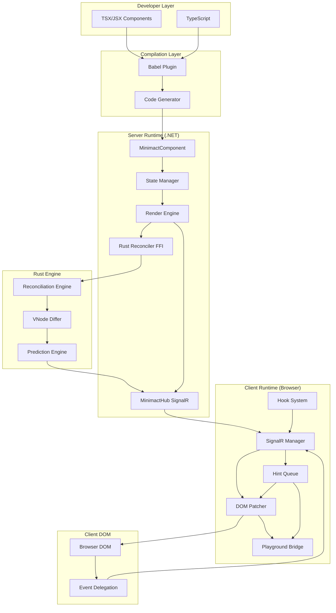

---

## Minimact Data Flow

### Complete Request/Response Cycle

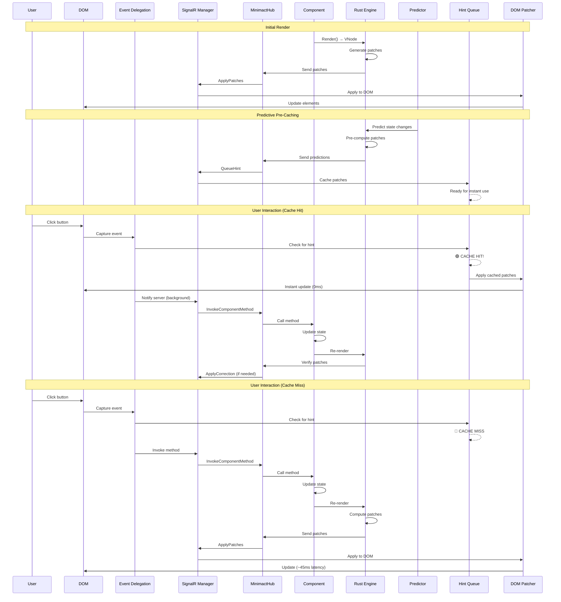

---

## Minimact Predictive Rendering

### Prediction Pipeline

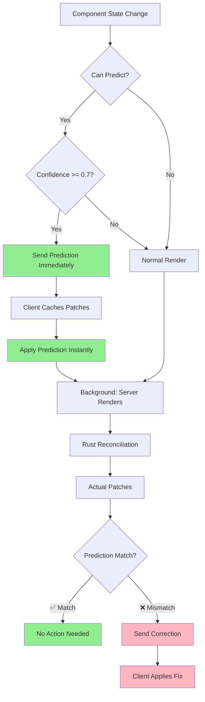

### Hint Queue System

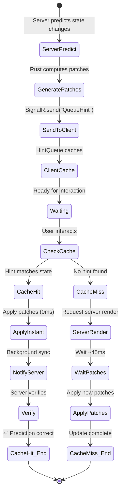

---

## Minimact State Synchronization

### State Sync Flow (NEW)

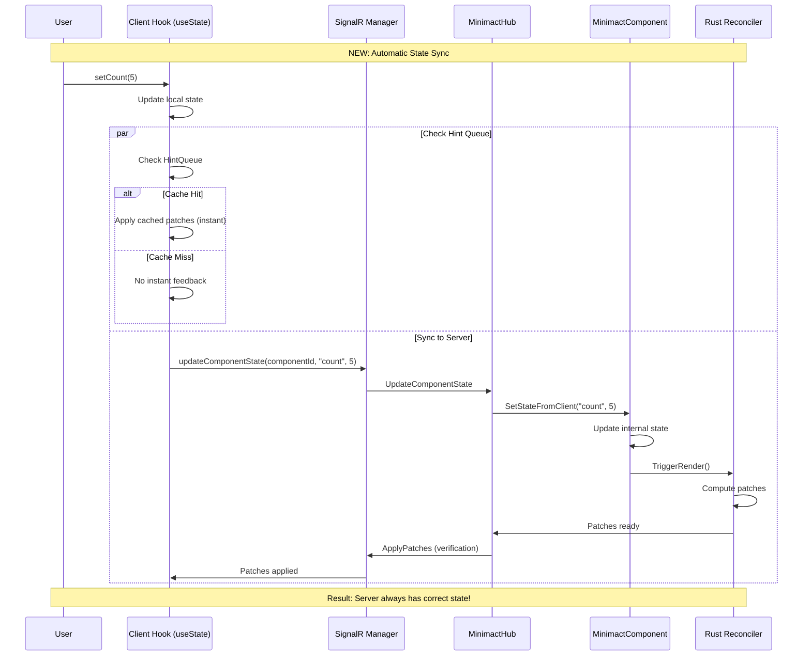

### State Classification

```mermaid
graph LR
    subgraph "State Types"
        SERVER[Server State<br/>[State] attribute<br/>Source: Server]
        CLIENT[Client State<br/>useClientState<br/>Source: Client]
        COMPUTED[Client-Computed<br/>[ClientComputed]<br/>Computed on client]
        HYBRID[Hybrid State<br/>useState + sync<br/>Both client & server]
    end

    subgraph "Synchronization"
        NONE[No Sync<br/>Pure client-side]
        ONEWAY[One-Way<br/>Client → Server]
        BIDIRECTIONAL[Bidirectional<br/>Auto-sync both ways]
    end

    subgraph "Latency"
        INSTANT[~1ms<br/>Local only]
        MEDIUM[~5ms<br/>Cached patches]
        NETWORK[~45ms<br/>Network round-trip]
    end

    CLIENT --> NONE
    CLIENT --> INSTANT

    COMPUTED --> ONEWAY
    COMPUTED --> NETWORK

    SERVER --> BIDIRECTIONAL
    SERVER --> NETWORK

    HYBRID --> BIDIRECTIONAL
    HYBRID --> MEDIUM

    style HYBRID fill:#90EE90
    style MEDIUM fill:#90EE90
```

---

## Minimact Punch Architecture

### useDomElementState Overview

```mermaid
graph TB
    subgraph "Client Runtime"
        HOOK[useDomElementState hook]
        STATE[DomElementState class]
        OBSERVERS[Browser Observers]
        SNAPSHOT[State Snapshot]
    end

    subgraph "Observers Layer"
        INTERSECT[IntersectionObserver]
        MUTATION[MutationObserver]
        RESIZE[ResizeObserver]
    end

    subgraph "Reactive Properties"
        PROPS[Properties<br/>- isIntersecting<br/>- childrenCount<br/>- attributes<br/>- classList]
        COLLECTION[Collection Methods<br/>- every()<br/>- some()<br/>- filter()]
        STATS[Statistics<br/>- vals.avg()<br/>- vals.sum()<br/>- vals.median()]
    end

    subgraph "Integration"
        CONTEXT[ComponentContext]
        HINTQUEUE[HintQueue]
        SIGNALR[SignalR Manager]
        PATCHER[DOM Patcher]
    end

    subgraph "Server Side"
        CSHARP[C# DomElementStateHook]
        HUB[MinimactHub]
        PREDICTOR[Prediction Engine]
    end

    HOOK --> STATE
    STATE --> OBSERVERS

    OBSERVERS --> INTERSECT
    OBSERVERS --> MUTATION
    OBSERVERS --> RESIZE

    INTERSECT --> SNAPSHOT
    MUTATION --> SNAPSHOT
    RESIZE --> SNAPSHOT

    SNAPSHOT --> PROPS
    SNAPSHOT --> COLLECTION
    SNAPSHOT --> STATS

    STATE --> CONTEXT
    CONTEXT --> HINTQUEUE
    CONTEXT --> SIGNALR
    CONTEXT --> PATCHER

    SIGNALR --> HUB
    HUB --> CSHARP
    CSHARP --> PREDICTOR
    PREDICTOR --> HINTQUEUE
```

### DOM State Reactive Loop

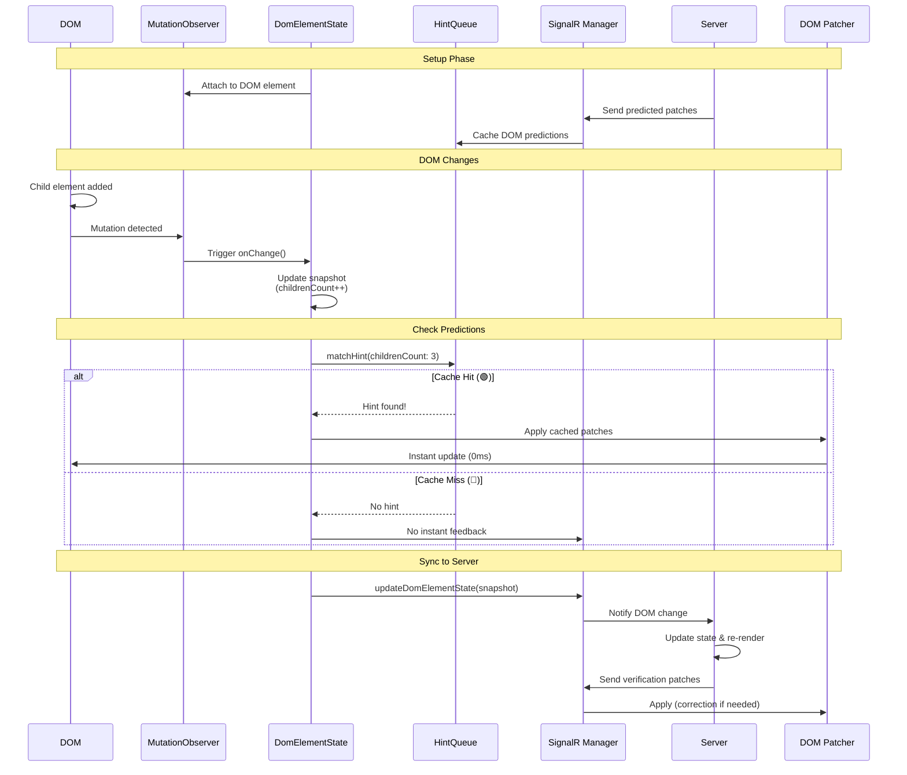

---

## Minimact Punch Integration

### Hook Integration Pattern

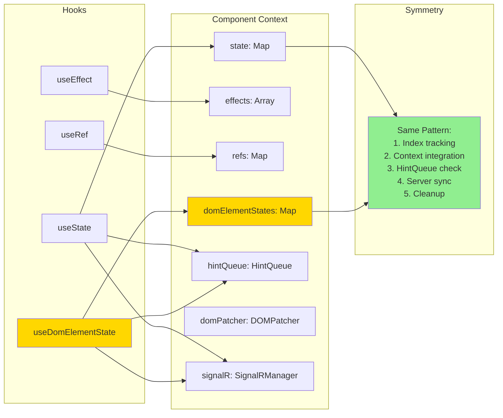

### MES Compliance Architecture

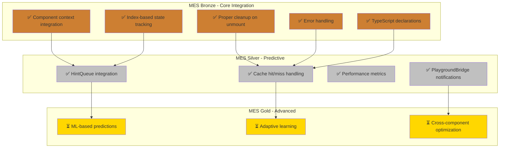

---

## Complete System Overview

### End-to-End Architecture

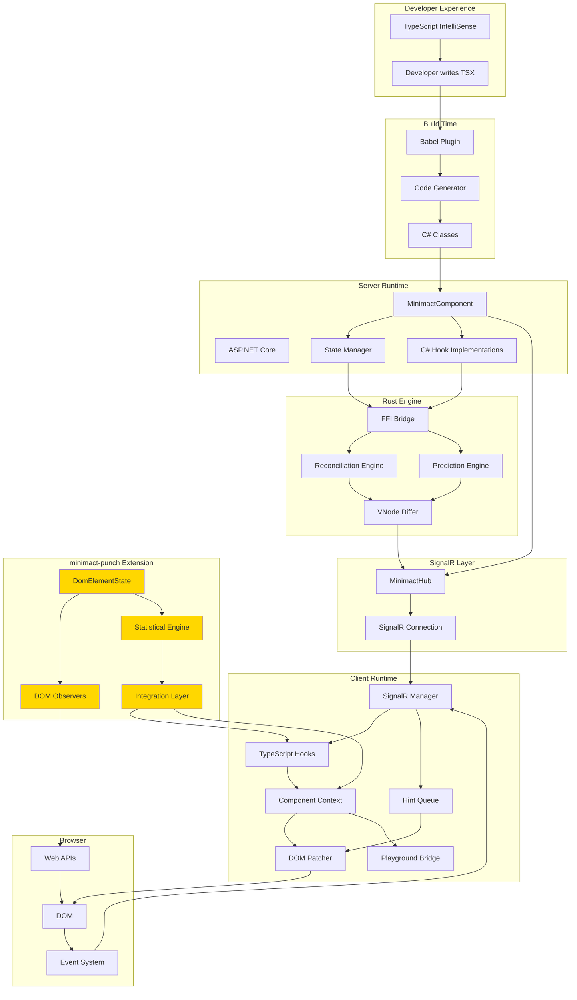

### Message Flow Matrix

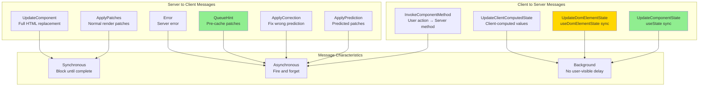

---

## Performance Characteristics

### Latency Comparison

```mermaid
gantt
    title Interaction Latency by Pattern
    dateFormat X
    axisFormat %L ms

    section Traditional SSR
    Network request: 0, 20
    Server processing: 20, 30
    Network response: 30, 50
    DOM update: 50, 52
    Total Traditional: milestone, 52, 0ms

    section Minimact Cache Hit
    Check cache: 0, 1
    Apply patches: 1, 2
    Background sync: 2, 47
    Total Cache Hit: milestone, 2, 0ms

    section Minimact Cache Miss
    Network request: 0, 20
    Server processing: 20, 30
    Network response: 30, 50
    Apply patches: 50, 52
    Total Cache Miss: milestone, 52, 0ms

    section Minimact Punch Hit
    DOM observer: 0, 0.5
    Check cache: 0.5, 1
    Apply patches: 1, 2
    Background sync: 2, 47
    Total Punch Hit: milestone, 2, 0ms
```

---

## Conclusion

These diagrams illustrate the complete architecture of Minimact and Minimact Punch, showing:

1. **Component Architecture** - How pieces fit together
2. **Data Flow** - Request/response cycles
3. **Predictive Rendering** - Cache hit/miss logic
4. **State Synchronization** - NEW auto-sync pattern
5. **Minimact Punch** - DOM reactivity extension
6. **Integration Patterns** - How hooks integrate
7. **Message Flows** - SignalR communication
8. **Performance** - Latency comparisons

The key innovation: **Server and client stay synchronized automatically**, preventing stale data issues while maintaining instant user feedback through predictive caching.

🌵 The cactus knows the topology of the desert. 🍹

---

## Additional Deep-Dive Diagrams

The following diagrams provide detailed answers to common architectural questions.

---

## Component Lifecycle & Initial Load

### Initial Page Load Flow

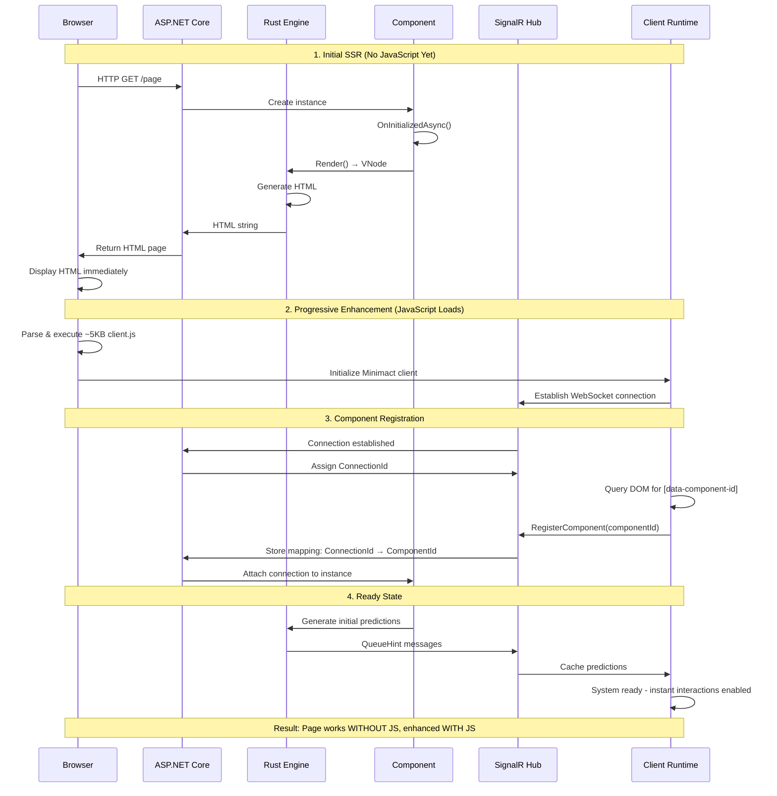

### Component ID Tracking

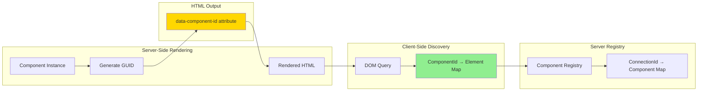

---

## Prediction Engine Deep Dive

### Learning & Pattern Detection

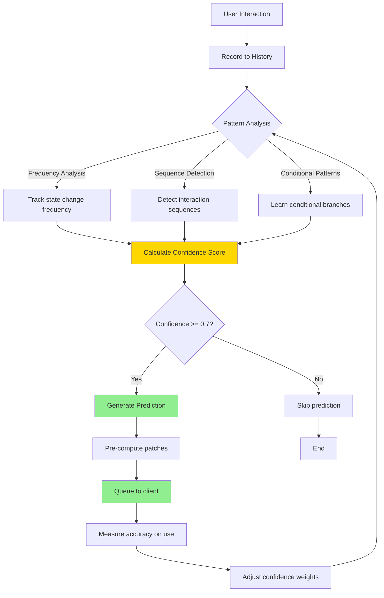

### Prediction Triggers & Processing

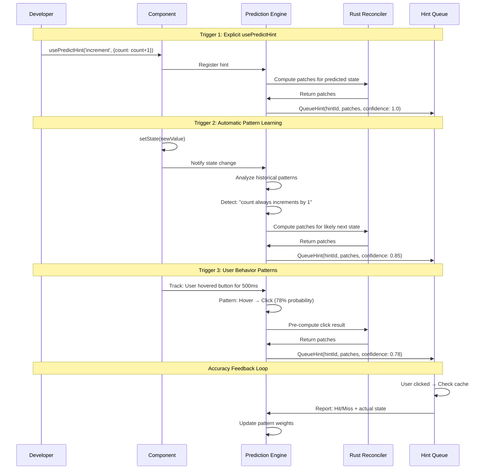

### Prediction Accuracy Measurement

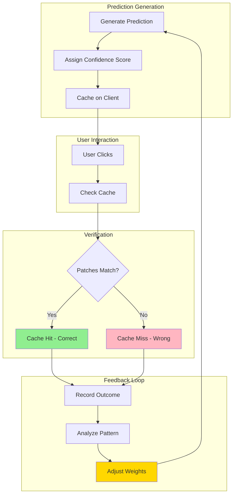

---

## Babel Plugin Transformation

### TSX to C# Example

**Input (Counter.tsx):**
```typescript
import { useState } from 'minimact';

export function Counter() {
    const [count, setCount] = useState(0);

    return (
        <div>
            <p>Count: {count}</p>
            <button onClick={() => setCount(count + 1)}>
                Increment
            </button>
        </div>
    );
}
```

**Output (Counter.cs):**
```csharp
using Minimact.AspNetCore.Core;
using Minimact.AspNetCore.VNodes;

namespace MyApp.Components
{
    public partial class Counter : MinimactComponent
    {
        [State]
        private int count = 0;

        protected override VNode Render()
        {
            return new VElement("div",
                new VElement("p", $"Count: {count}"),
                new VElement("button",
                    new VAttribute("onClick", nameof(Increment)),
                    "Increment"
                )
            );
        }

        private void Increment()
        {
            count++;
            SetState(nameof(count), count);
        }
    }
}
```

### Transformation Pipeline

```mermaid
flowchart TD
    START[Counter.tsx] --> PARSE[Babel Parse AST]

    PARSE --> DETECT[Detect Hooks]
    DETECT --> HOOK_STATE{Hook Type?}

    HOOK_STATE -->|useState| GEN_STATE[Generate [State] field]
    HOOK_STATE -->|useEffect| GEN_EFFECT[Generate lifecycle method]
    HOOK_STATE -->|useRef| GEN_REF[Generate private field]

    GEN_STATE --> TRACK_DEPS[Track dependencies]
    GEN_EFFECT --> TRACK_DEPS
    GEN_REF --> TRACK_DEPS

    TRACK_DEPS --> JSX[Parse JSX]
    JSX --> BUILD_VNODE[Build VNode tree]

    BUILD_VNODE --> EVENTS{Event Handlers?}
    EVENTS -->|Yes| GEN_METHODS[Generate C# methods]
    EVENTS -->|No| CONTINUE

    GEN_METHODS --> CONTINUE[Continue]
    CONTINUE --> TYPE_MAP[Map TS types to C# types]

    TYPE_MAP --> OUTPUT[Generate Counter.cs]

    style GEN_STATE fill:#90EE90
    style BUILD_VNODE fill:#FFD700
    style OUTPUT fill:#3b82f6
```

### Type Mapping Table

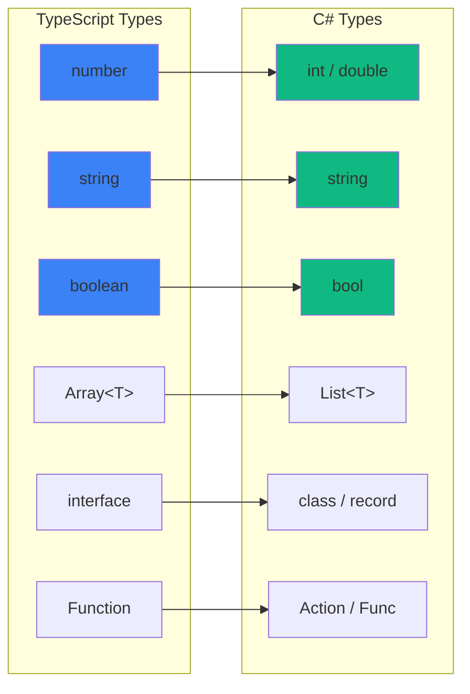

---

## Security & Authorization Model

### Method Invocation Security

```mermaid
sequenceDiagram
    participant Client
    participant SignalR as SignalR Hub
    participant Auth as Authorization
    participant Registry as Component Registry
    participant Comp as Component

    Note over Client,Comp: Secure Method Invocation Flow

    Client->>SignalR: InvokeComponentMethod(componentId, "UpdateProfile", args)

    SignalR->>Auth: ValidateConnection()
    Auth->>Auth: Check User.Identity
    Auth->>Auth: Verify ConnectionId is authenticated

    alt Not Authenticated
        Auth->>Client: 401 Unauthorized
    end

    SignalR->>Registry: GetComponent(componentId)

    alt Component Not Found
        Registry->>Client: Error: Component not found
    end

    Registry->>Registry: Verify component belongs to this connection

    alt Wrong Connection
        Registry->>Client: Error: Unauthorized access
    end

    SignalR->>Comp: Check [Authorize] attribute on method

    alt Has [Authorize(Roles="Admin")]
        Comp->>Auth: Check User.IsInRole("Admin")
        Auth-->>Comp: False
        Comp->>Client: Error: Forbidden
    end

    Comp->>Comp: Validate method parameters

    alt Invalid Parameters
        Comp->>Client: Error: Validation failed
    end

    Comp->>Comp: Invoke method via reflection
    Comp->>Comp: Update state
    Comp->>Client: Success
```

### State Validation Flow

```mermaid
flowchart TD
    START[Client sends UpdateComponentState] --> AUTH{User Authenticated?}

    AUTH -->|No| REJECT1[Reject: 401 Unauthorized]
    AUTH -->|Yes| OWNER{Owns Component?}

    OWNER -->|No| REJECT2[Reject: 403 Forbidden]
    OWNER -->|Yes| VALIDATE[Validate State Value]

    VALIDATE --> TYPE{Type Valid?}
    TYPE -->|No| REJECT3[Reject: Invalid type]
    TYPE -->|Yes| RANGE{Range Valid?}

    RANGE -->|No| REJECT4[Reject: Out of range]
    RANGE -->|Yes| SANITIZE[Sanitize Input]

    SANITIZE --> CUSTOM{Custom Validator?}
    CUSTOM -->|Yes| RUN_VALIDATOR[Run validation logic]
    CUSTOM -->|No| APPLY

    RUN_VALIDATOR --> VALID{Valid?}
    VALID -->|No| REJECT5[Reject: Custom validation failed]
    VALID -->|Yes| APPLY[Apply state change]

    APPLY --> LOG[Log change for audit]
    LOG --> SUCCESS[Success]

    style REJECT1 fill:#FFB6C1
    style REJECT2 fill:#FFB6C1
    style REJECT3 fill:#FFB6C1
    style REJECT4 fill:#FFB6C1
    style REJECT5 fill:#FFB6C1
    style SUCCESS fill:#90EE90
```

### Security Layers

```mermaid
graph TB
    subgraph "Layer 1: Connection Security"
        SSL[HTTPS/WSS Only]
        AUTH[ASP.NET Core Authentication]
        SESSION[Session Management]
    end

    subgraph "Layer 2: Component Ownership"
        REGISTRY[Component Registry]
        MAPPING[ConnectionId → Component]
        ISOLATION[Per-connection isolation]
    end

    subgraph "Layer 3: Method Authorization"
        ATTR[Authorize Attributes]
        ROLES[Role-based access]
        CLAIMS[Claims-based access]
    end

    subgraph "Layer 4: Input Validation"
        TYPE_CHECK[Type validation]
        RANGE_CHECK[Range validation]
        SANITIZE[Input sanitization]
        CUSTOM[Custom validators]
    end

    subgraph "Layer 5: Rate Limiting"
        THROTTLE[Request throttling]
        QUOTA[Per-user quotas]
        ABUSE[Abuse detection]
    end

    SSL --> REGISTRY
    AUTH --> REGISTRY
    SESSION --> REGISTRY

    REGISTRY --> ATTR
    MAPPING --> ATTR
    ISOLATION --> ATTR

    ATTR --> TYPE_CHECK
    ROLES --> TYPE_CHECK
    CLAIMS --> TYPE_CHECK

    TYPE_CHECK --> THROTTLE
    RANGE_CHECK --> THROTTLE
    SANITIZE --> THROTTLE
    CUSTOM --> THROTTLE

    style SSL fill:#90EE90
    style AUTH fill:#90EE90
    style ATTR fill:#FFD700
    style TYPE_CHECK fill:#3b82f6
```

### Example: Preventing Malicious State Updates

```mermaid
sequenceDiagram
    participant Attacker as Malicious Client
    participant SignalR
    participant Validator
    participant Component

    Note over Attacker,Component: Attack Attempt: Send Invalid State

    Attacker->>SignalR: UpdateComponentState("count", 999999999)

    SignalR->>Validator: Validate state change

    Validator->>Validator: Check type: int ✓
    Validator->>Validator: Check range: > max allowed (1000)

    Validator->>Attacker: ❌ Error: Value exceeds maximum (1000)

    Note over Attacker,Component: Attack Attempt: Access Other User's Component

    Attacker->>SignalR: InvokeComponentMethod("other-user-component", "DeleteAccount")

    SignalR->>SignalR: Verify component ownership
    SignalR->>SignalR: ComponentId belongs to different ConnectionId

    SignalR->>Attacker: ❌ Error: Unauthorized access to component

    Note over Attacker,Component: Attack Attempt: Call Protected Method

    Attacker->>SignalR: InvokeComponentMethod("admin-panel", "DeleteAllUsers")

    SignalR->>Component: Check [Authorize(Roles="Admin")]
    Component->>Component: User.IsInRole("Admin") = false

    Component->>Attacker: ❌ Error: Forbidden - Admin role required

    Note over Attacker,Component: Result: All attacks blocked by security layers
```

---

## Conclusion

These additional diagrams provide deep dives into:

1. **Component Lifecycle** - From initial SSR through SignalR connection to ready state
2. **Prediction Engine** - Learning patterns, triggers, and accuracy measurement
3. **Babel Transformation** - Concrete TSX→C# examples with type mapping
4. **Security Model** - Multi-layer security with validation and authorization

Together with the original diagrams, this provides complete architectural documentation for Minimact.

**The cactus doesn't just survive—it thrives by knowing what comes next.** 🌵⚡

---

## Developer Workflow & Experience

The following diagrams show how developers actually build and iterate on Minimact applications.

---

## Project Setup & Scaffolding

### New Project Creation

```mermaid
flowchart TD
    START[minimact new my-app] --> SCAFFOLD[Run scaffolding tool]

    SCAFFOLD --> CREATE_DIRS[Create directory structure]
    CREATE_DIRS --> GEN_FILES[Generate template files]
    GEN_FILES --> INSTALL[Install dependencies]

    INSTALL --> NPM[npm install]
    INSTALL --> DOTNET[dotnet restore]

    NPM --> READY[Project ready]
    DOTNET --> READY

    READY --> SHOW[Display welcome message]

    style SCAFFOLD fill:#3b82f6
    style READY fill:#90EE90
```

### Generated Project Structure

```mermaid
graph TB
    subgraph "Project Root"
        ROOT[my-app/]
    end

    subgraph "Source Code"
        SRC[src/]
        COMP[components/]
        PAGES[pages/]
        TEMPLATES[templates/]
        SERVICES[services/]
    end

    subgraph "Component Files"
        TSX[Counter.tsx<br/>Developer writes]
        CS_GEN[Counter.cs<br/>Generated - do not edit]
        CS_BEHIND[Counter.codebehind.cs<br/>Optional - business logic]
    end

    subgraph "Configuration"
        BABEL[babel.config.js<br/>Minimact plugin]
        TSCONFIG[tsconfig.json<br/>TypeScript config]
        CSPROJ[MyApp.csproj<br/>C# project file]
        PROGRAM[Program.cs<br/>ASP.NET setup]
    end

    subgraph "Client Assets"
        WWWROOT[wwwroot/]
        CLIENT_JS[minimact-client.js<br/>~5KB runtime]
        STATIC[static assets]
    end

    subgraph "Build Output"
        BIN[bin/]
        OBJ[obj/]
        DIST[dist/]
    end

    ROOT --> SRC
    ROOT --> WWWROOT
    ROOT --> BABEL
    ROOT --> TSCONFIG
    ROOT --> CSPROJ
    ROOT --> PROGRAM
    ROOT --> BIN

    SRC --> COMP
    SRC --> PAGES
    SRC --> TEMPLATES
    SRC --> SERVICES

    COMP --> TSX
    COMP --> CS_GEN
    COMP --> CS_BEHIND

    WWWROOT --> CLIENT_JS
    WWWROOT --> STATIC

    style TSX fill:#3b82f6
    style CS_GEN fill:#f59e0b
    style CS_BEHIND fill:#10b981
```

---

## Development Loop

### Inner Development Loop

```mermaid
sequenceDiagram
    participant Dev as Developer
    participant IDE as VS Code/Rider
    participant Watch as File Watcher
    participant Babel as Babel Plugin
    participant DotNet as .NET Compiler
    participant Server as Dev Server
    participant Browser

    Note over Dev,Browser: Developer Iteration Cycle

    Dev->>IDE: Edit Counter.tsx
    IDE->>IDE: Save file

    IDE->>Watch: File change detected
    Watch->>Babel: Transform Counter.tsx

    Babel->>Babel: Parse TSX AST
    Babel->>Babel: Generate C# code
    Babel->>CS_File: Write Counter.cs

    Note over Watch,Server: Automatic Build
    Watch->>DotNet: Trigger incremental build
    DotNet->>DotNet: Compile Counter.cs

    alt Compilation Error
        DotNet->>IDE: Show error in Problems panel
        IDE->>Dev: Display error
    else Success
        DotNet->>Server: Hot reload (if supported)
        alt Hot Reload Available
            Server->>Browser: Inject update (no refresh)
        else No Hot Reload
            Dev->>Browser: Manual refresh F5
        end
        Browser->>Browser: Re-render component
    end

    Note over Dev,Browser: Changes visible in ~2-3 seconds
```

### File Save Cascade

```mermaid
flowchart LR
    SAVE[Save Counter.tsx] --> DETECT[File Watcher]

    DETECT --> BABEL{Babel Transform}

    BABEL -->|Generate| CS[Counter.cs]
    BABEL -->|Error| TS_ERR[TypeScript Error<br/>Show in IDE]

    CS --> COMPILE{C# Compile}

    COMPILE -->|Success| HOT{Hot Reload?}
    COMPILE -->|Error| CS_ERR[C# Error<br/>Show in IDE]

    HOT -->|Yes| INJECT[Inject changes]
    HOT -->|No| MANUAL[Manual refresh]

    INJECT --> BROWSER[Browser updates]
    MANUAL --> BROWSER

    style SAVE fill:#3b82f6
    style BROWSER fill:#90EE90
    style TS_ERR fill:#FFB6C1
    style CS_ERR fill:#FFB6C1
```

---

## Build Pipeline

### Development Build

```mermaid
flowchart TD
    START[minimact dev] --> CLEAN[Clean previous build]

    CLEAN --> WATCH_START[Start file watchers]

    WATCH_START --> BABEL_WATCH[Babel: Watch *.tsx]
    WATCH_START --> DOTNET_WATCH[dotnet: Watch *.cs]

    BABEL_WATCH --> TRANSFORM[Transform all .tsx → .cs]
    TRANSFORM --> COMPILE[dotnet build]

    COMPILE --> RUN[dotnet run]

    RUN --> SERVE[Start Kestrel server]
    SERVE --> SIGNALR[Initialize SignalR hub]
    SIGNALR --> READY[Server ready on localhost:5000]

    READY --> LOOP[Watch loop active]

    style READY fill:#90EE90
    style LOOP fill:#FFD700
```

### Production Build

```mermaid
flowchart TD
    START[minimact build] --> CLEAN[Clean output]

    CLEAN --> BABEL[Babel: Transform all .tsx]
    BABEL --> VERIFY[Verify no TypeScript errors]

    VERIFY --> COMPILE[dotnet publish -c Release]

    COMPILE --> OPTIMIZE[Optimize C# code]
    OPTIMIZE --> MINIFY[Minify client.js]
    MINIFY --> BUNDLE[Bundle assets]

    BUNDLE --> OUTPUT[Output to /dist]

    OUTPUT --> ARTIFACTS{Build artifacts}

    ARTIFACTS --> DLLS[*.dll assemblies]
    ARTIFACTS --> WWWROOT[wwwroot/ static files]
    ARTIFACTS --> RUNTIME[ASP.NET runtime files]

    style OUTPUT fill:#90EE90
```

---

## Code-Behind Pattern

### When to Use Code-Behind

```mermaid
graph TB
    subgraph "Counter.tsx - UI Logic"
        TSX_UI["export function Counter() {
  const [count, setCount] = useState(0);
  const data = useServerData();

  return (
    <div>
      <p>Count: {count}</p>
      <button onClick={increment}>+</button>
    </div>
  );
}"]
    end

    subgraph "Counter.cs - Generated (Don't Edit)"
        CS_GEN["public partial class Counter : MinimactComponent {
  [State] private int count = 0;

  protected override VNode Render() {
    var data = UseServerData();
    return new VElement(...);
  }

  private void increment() {
    count++;
    SetState(nameof(count), count);
  }
}"]
    end

    subgraph "Counter.codebehind.cs - Business Logic"
        CS_BEHIND["public partial class Counter {
  private readonly AppDbContext _db;

  public Counter(AppDbContext db) {
    _db = db;
  }

  private async Task<UserData> UseServerData() {
    return await _db.Users
      .Where(u => u.Id == UserId)
      .Include(u => u.Orders)
      .FirstOrDefaultAsync();
  }
}"]
    end

    TSX_UI -->|Babel transforms| CS_GEN
    CS_GEN -->|partial class| CS_BEHIND

    style TSX_UI fill:#3b82f6
    style CS_GEN fill:#f59e0b
    style CS_BEHIND fill:#10b981
```

### Code-Behind Use Cases

```mermaid
flowchart TD
    QUESTION{What are you doing?}

    QUESTION -->|UI state & logic| TSX[Write in .tsx only]
    QUESTION -->|Database queries| CODEBEHIND[Use .codebehind.cs]
    QUESTION -->|API calls| CODEBEHIND
    QUESTION -->|Complex validation| CODEBEHIND
    QUESTION -->|Business rules| CODEBEHIND
    QUESTION -->|DI services| CODEBEHIND

    TSX --> TSX_RESULT[Babel handles everything]
    CODEBEHIND --> CS_RESULT[Manual C# code<br/>Full .NET power]

    style TSX fill:#3b82f6
    style CODEBEHIND fill:#10b981
```

---

## Developer Commands

### Common Workflows

```mermaid
graph LR
    subgraph "Development Commands"
        DEV[minimact dev]
        BUILD[minimact build]
        NEW_COMP[minimact new component]
        NEW_PAGE[minimact new page]
        TEST[minimact test]
    end

    subgraph "What They Do"
        DEV_DESC["Start dev server
        - File watching
        - Hot reload
        - Source maps"]

        BUILD_DESC["Production build
        - Optimize
        - Minify
        - Bundle"]

        COMP_DESC["Scaffold component
        - Counter.tsx
        - Optional .codebehind.cs"]

        PAGE_DESC["Scaffold page
        - Route setup
        - Template"]

        TEST_DESC["Run tests
        - Unit tests
        - Integration tests"]
    end

    DEV --> DEV_DESC
    BUILD --> BUILD_DESC
    NEW_COMP --> COMP_DESC
    NEW_PAGE --> PAGE_DESC
    TEST --> TEST_DESC

    style DEV fill:#3b82f6
    style BUILD fill:#10b981
```

---

## Debugging Experience

### Error Handling & Display

```mermaid
sequenceDiagram
    participant Dev
    participant IDE
    participant Babel
    participant Compiler
    participant Server
    participant Browser
    participant Playground

    Note over Dev,Playground: TypeScript Error
    Dev->>IDE: Write invalid TSX
    IDE->>IDE: TypeScript LSP check
    IDE->>Dev: Red squiggle + error
    Dev->>IDE: Save anyway
    IDE->>Babel: Transform
    Babel->>IDE: ❌ Syntax Error
    IDE->>Dev: Show in Problems panel

    Note over Dev,Playground: C# Compilation Error
    Dev->>IDE: Reference undefined method
    Babel->>Compiler: Generate .cs
    Compiler->>Compiler: ❌ Cannot resolve method
    Compiler->>IDE: Error CS0103
    IDE->>Dev: Show in Problems panel

    Note over Dev,Playground: Runtime Error (Server)
    Dev->>Browser: Trigger action
    Browser->>Server: SignalR method call
    Server->>Server: ❌ NullReferenceException
    Server->>Browser: Error message
    Browser->>Dev: Console error
    Server->>IDE: Exception in Output panel

    Note over Dev,Playground: Runtime Error (Client)
    Browser->>Browser: ❌ Cannot apply patch
    Browser->>Playground: Show error in bridge
    Playground->>Dev: Visual indicator
    Browser->>Dev: Console error with stack trace
```

### Debugging Tools

```mermaid
graph TB
    subgraph "IDE Debugging"
        BREAKPOINT[C# Breakpoints]
        WATCH[Watch Variables]
        CALL_STACK[Call Stack]
        IMMEDIATE[Immediate Window]
    end

    subgraph "Browser DevTools"
        CONSOLE[Console Logging]
        NETWORK[SignalR Traffic]
        ELEMENTS[DOM Inspection]
        PERF[Performance Timeline]
    end

    subgraph "Minimact Tools"
        PLAYGROUND[Playground Bridge]
        HINTS[Hint Queue Viewer]
        PATCHES[Patch Inspector]
        METRICS[Performance Metrics]
    end

    BREAKPOINT --> SERVER_DEBUG[Debug server-side logic]
    WATCH --> SERVER_DEBUG

    CONSOLE --> CLIENT_DEBUG[Debug client-side]
    NETWORK --> CLIENT_DEBUG

    PLAYGROUND --> VISUAL[Visual debugging]
    HINTS --> VISUAL
    PATCHES --> VISUAL

    style PLAYGROUND fill:#FFD700
    style BREAKPOINT fill:#3b82f6
    style CONSOLE fill:#10b981
```

---

## Integration Points

### Adding Database (EF Core)

```mermaid
flowchart TD
    START[Need database access] --> INSTALL[Install EF Core packages]

    INSTALL --> CONTEXT[Create DbContext]

    CONTEXT --> MODELS[Define entity models]

    MODELS --> REGISTER[Register in Program.cs]

    REGISTER --> CONFIG["services.AddDbContext<AppDbContext>(...)"]

    CONFIG --> MIGRATE[Create migrations]

    MIGRATE --> USE[Use in component]

    USE --> INJECT[Inject via constructor]

    INJECT --> CODEBEHIND[Write queries in .codebehind.cs]

    CODEBEHIND --> EXAMPLE["private async Task<List<Todo>> LoadTodos() {
  return await _db.Todos
    .Where(t => t.UserId == UserId)
    .ToListAsync();
}"]

    style CONFIG fill:#3b82f6
    style CODEBEHIND fill:#10b981
```

### Adding Authentication

```mermaid
flowchart LR
    START[Add auth] --> CHOOSE{Auth type?}

    CHOOSE -->|Cookie| COOKIE[ASP.NET Identity]
    CHOOSE -->|JWT| JWT[JWT tokens]
    CHOOSE -->|OAuth| OAUTH[External providers]

    COOKIE --> SETUP_COOKIE[Configure in Program.cs]
    JWT --> SETUP_JWT[Configure JWT middleware]
    OAUTH --> SETUP_OAUTH[Configure OAuth providers]

    SETUP_COOKIE --> USE_AUTH[Use in components]
    SETUP_JWT --> USE_AUTH
    SETUP_OAUTH --> USE_AUTH

    USE_AUTH --> ATTR["[Authorize] attribute"]
    USE_AUTH --> USER[Access User.Identity]
    USE_AUTH --> CLAIMS[Access User.Claims]

    style ATTR fill:#10b981
```

### Project Integration Overview

```mermaid
graph TB
    subgraph "Minimact Component"
        COMP[MyComponent.tsx]
        CODEBEHIND[MyComponent.codebehind.cs]
    end

    subgraph "ASP.NET Core Services"
        DB[(Database<br/>EF Core)]
        AUTH[Authentication]
        DI[Dependency Injection]
        CONFIG[Configuration]
        LOGGING[Logging]
    end

    subgraph "External Services"
        API[External APIs]
        CACHE[Redis Cache]
        QUEUE[Message Queue]
        STORAGE[Blob Storage]
    end

    CODEBEHIND --> DB
    CODEBEHIND --> AUTH
    CODEBEHIND --> DI
    CODEBEHIND --> CONFIG
    CODEBEHIND --> LOGGING

    CODEBEHIND --> API
    CODEBEHIND --> CACHE
    CODEBEHIND --> QUEUE
    CODEBEHIND --> STORAGE

    style COMP fill:#3b82f6
    style CODEBEHIND fill:#10b981
    style DB fill:#FFD700
```

---

## Complete Developer Journey

### From Zero to Deployed App

```mermaid
flowchart TD
    START[Developer starts] --> INSTALL[Install Minimact CLI]

    INSTALL --> CREATE[minimact new my-app]

    CREATE --> STRUCTURE[Project scaffolded]

    STRUCTURE --> DEV_START[minimact dev]

    DEV_START --> WRITE[Write components in TSX]

    WRITE --> SAVE[Save file]

    SAVE --> AUTO_BUILD[Automatic build & reload]

    AUTO_BUILD --> BROWSER[See changes in browser]

    BROWSER --> DEBUG{Need debugging?}

    DEBUG -->|Yes| BREAKPOINT[Set C# breakpoints]
    DEBUG -->|No| MORE{More features?}

    BREAKPOINT --> BROWSER

    MORE -->|Yes| ADD_DB[Add database]
    MORE -->|No| READY[Ready for production]

    ADD_DB --> ADD_AUTH[Add authentication]
    ADD_AUTH --> ADD_API[Add API integration]
    ADD_API --> TEST[Write tests]

    TEST --> READY

    READY --> BUILD_PROD[minimact build]

    BUILD_PROD --> DEPLOY[Deploy to Azure/AWS]

    DEPLOY --> LIVE[App is live! 🎉]

    style START fill:#3b82f6
    style LIVE fill:#90EE90
    style WRITE fill:#FFD700
```

---

## Conclusion - Developer Experience

These diagrams show the complete developer workflow:

1. **Project Setup** - Scaffolding and structure
2. **Development Loop** - Inner loop with file watching and hot reload
3. **Build Pipeline** - Dev vs production builds
4. **Code-Behind Pattern** - When and how to use it
5. **Commands** - Common workflows and CLI
6. **Debugging** - Tools and error handling
7. **Integration** - Database, auth, and services
8. **Journey** - End-to-end developer experience

**The cactus knows not just the topology, but how to navigate it.** 🌵🧭
