# Minimact Architecture Diagrams

This document contains comprehensive Mermaid diagrams showing the architecture, data flows, and messaging patterns for Minimact and Minimact Punch.

---

## Table of Contents

1. [Minimact Core Architecture](#minimact-core-architecture)
2. [Minimact Data Flow](#minimact-data-flow)
3. [Minimact Predictive Rendering](#minimact-predictive-rendering)
4. [Minimact State Synchronization](#minimact-state-synchronization)
5. [Minimact Punch Architecture](#minimact-punch-architecture)
6. [Minimact Punch Integration](#minimact-punch-integration)
7. [Complete System Overview](#complete-system-overview)

---

## Minimact Core Architecture

### System Components


---

## Minimact Data Flow

### Complete Request/Response Cycle

```mermaid
sequenceDiagram
    participant User
    participant DOM
    participant EventDel as Event Delegation
    participant SignalR as SignalR Manager
    participant Hub as MinimactHub
    participant Comp as Component
    participant Rust as Rust Engine
    participant Predictor
    participant Queue as Hint Queue
    participant Patcher as DOM Patcher

    Note over User,Patcher: Initial Render
    Comp->>Rust: Render() → VNode
    Rust->>Rust: Generate patches
    Rust->>Hub: Send patches
    Hub->>SignalR: ApplyPatches
    SignalR->>Patcher: Apply to DOM
    Patcher->>DOM: Update elements

    Note over User,Patcher: Predictive Pre-Caching
    Predictor->>Rust: Predict state changes
    Rust->>Rust: Pre-compute patches
    Rust->>Hub: Send predictions
    Hub->>SignalR: QueueHint
    SignalR->>Queue: Cache patches
    Queue-->>Queue: Ready for instant use

    Note over User,Patcher: User Interaction (Cache Hit)
    User->>DOM: Click button
    DOM->>EventDel: Capture event
    EventDel->>Queue: Check for hint
    Queue-->>Queue: 🟢 CACHE HIT!
    Queue->>Patcher: Apply cached patches
    Patcher->>DOM: Instant update (0ms)
    EventDel->>SignalR: Notify server (background)
    SignalR->>Hub: InvokeComponentMethod
    Hub->>Comp: Call method
    Comp->>Comp: Update state
    Comp->>Rust: Re-render
    Rust->>Hub: Verify patches
    Hub->>SignalR: ApplyCorrection (if needed)

    Note over User,Patcher: User Interaction (Cache Miss)
    User->>DOM: Click button
    DOM->>EventDel: Capture event
    EventDel->>Queue: Check for hint
    Queue-->>Queue: 🔴 CACHE MISS
    EventDel->>SignalR: Invoke method
    SignalR->>Hub: InvokeComponentMethod
    Hub->>Comp: Call method
    Comp->>Comp: Update state
    Comp->>Rust: Re-render
    Rust->>Rust: Compute patches
    Rust->>Hub: Send patches
    Hub->>SignalR: ApplyPatches
    SignalR->>Patcher: Apply to DOM
    Patcher->>DOM: Update (~45ms latency)
```



---

## Minimact Predictive Rendering

### Prediction Pipeline


### Hint Queue System

```mermaid
stateDiagram-v2
    [*] --> ServerPredict: Server predicts state changes

    ServerPredict --> GeneratePatches: Rust computes patches
    GeneratePatches --> SendToClient: SignalR.send("QueueHint")
    SendToClient --> ClientCache: HintQueue caches

    ClientCache --> Waiting: Ready for interaction

    Waiting --> CheckCache: User interacts

    CheckCache --> CacheHit: Hint matches state
    CheckCache --> CacheMiss: No hint found

    CacheHit --> ApplyInstant: Apply patches (0ms)
    ApplyInstant --> NotifyServer: Background sync
    NotifyServer --> Verify: Server verifies
    Verify --> CacheHit_End: ✅ Prediction correct

    CacheMiss --> ServerRender: Request server render
    ServerRender --> WaitPatches: Wait ~45ms
    WaitPatches --> ApplyPatches: Apply new patches
    ApplyPatches --> CacheMiss_End: Update complete

    CacheHit_End --> [*]
    CacheMiss_End --> [*]
```



---

## Minimact State Synchronization

### State Sync Flow (NEW)


### State Classification

```mermaid
graph LR
    subgraph "State Types"
        SERVER[Server State<br/>[State] attribute<br/>Source: Server]
        CLIENT[Client State<br/>useClientState<br/>Source: Client]
        COMPUTED[Client-Computed<br/>[ClientComputed]<br/>Computed on client]
        HYBRID[Hybrid State<br/>useState + sync<br/>Both client & server]
    end

    subgraph "Synchronization"
        NONE[No Sync<br/>Pure client-side]
        ONEWAY[One-Way<br/>Client → Server]
        BIDIRECTIONAL[Bidirectional<br/>Auto-sync both ways]
    end

    subgraph "Latency"
        INSTANT[~1ms<br/>Local only]
        MEDIUM[~5ms<br/>Cached patches]
        NETWORK[~45ms<br/>Network round-trip]
    end

    CLIENT --> NONE
    CLIENT --> INSTANT

    COMPUTED --> ONEWAY
    COMPUTED --> NETWORK

    SERVER --> BIDIRECTIONAL
    SERVER --> NETWORK

    HYBRID --> BIDIRECTIONAL
    HYBRID --> MEDIUM

    style HYBRID fill:#90EE90
    style MEDIUM fill:#90EE90
```

---

## Minimact Punch Architecture

### useDomElementState Overview

```mermaid
graph TB
    subgraph "Client Runtime"
        HOOK[useDomElementState hook]
        STATE[DomElementState class]
        OBSERVERS[Browser Observers]
        SNAPSHOT[State Snapshot]
    end

    subgraph "Observers Layer"
        INTERSECT[IntersectionObserver]
        MUTATION[MutationObserver]
        RESIZE[ResizeObserver]
    end

    subgraph "Reactive Properties"
        PROPS[Properties<br/>- isIntersecting<br/>- childrenCount<br/>- attributes<br/>- classList]
        COLLECTION[Collection Methods<br/>- every()<br/>- some()<br/>- filter()]
        STATS[Statistics<br/>- vals.avg()<br/>- vals.sum()<br/>- vals.median()]
    end

    subgraph "Integration"
        CONTEXT[ComponentContext]
        HINTQUEUE[HintQueue]
        SIGNALR[SignalR Manager]
        PATCHER[DOM Patcher]
    end

    subgraph "Server Side"
        CSHARP[C# DomElementStateHook]
        HUB[MinimactHub]
        PREDICTOR[Prediction Engine]
    end

    HOOK --> STATE
    STATE --> OBSERVERS

    OBSERVERS --> INTERSECT
    OBSERVERS --> MUTATION
    OBSERVERS --> RESIZE

    INTERSECT --> SNAPSHOT
    MUTATION --> SNAPSHOT
    RESIZE --> SNAPSHOT

    SNAPSHOT --> PROPS
    SNAPSHOT --> COLLECTION
    SNAPSHOT --> STATS

    STATE --> CONTEXT
    CONTEXT --> HINTQUEUE
    CONTEXT --> SIGNALR
    CONTEXT --> PATCHER

    SIGNALR --> HUB
    HUB --> CSHARP
    CSHARP --> PREDICTOR
    PREDICTOR --> HINTQUEUE
```

### DOM State Reactive Loop


---

## Minimact Punch Integration

### Hook Integration Pattern


### MES Compliance Architecture

```mermaid
graph TD
    subgraph "MES Bronze - Core Integration"
        B1[✅ Component context integration]
        B2[✅ Index-based state tracking]
        B3[✅ Proper cleanup on unmount]
        B4[✅ Error handling]
        B5[✅ TypeScript declarations]
    end

    subgraph "MES Silver - Predictive"
        S1[✅ HintQueue integration]
        S2[✅ Cache hit/miss handling]
        S3[✅ Performance metrics]
        S4[✅ PlaygroundBridge notifications]
    end

    subgraph "MES Gold - Advanced"
        G1[⏳ ML-based predictions]
        G2[⏳ Adaptive learning]
        G3[⏳ Cross-component optimization]
    end

    B1 --> S1
    B2 --> S1
    B3 --> S2
    B4 --> S2
    B5 --> S2

    S1 --> G1
    S2 --> G2
    S4 --> G3

    style B1 fill:#CD7F32
    style B2 fill:#CD7F32
    style B3 fill:#CD7F32
    style B4 fill:#CD7F32
    style B5 fill:#CD7F32

    style S1 fill:#C0C0C0
    style S2 fill:#C0C0C0
    style S3 fill:#C0C0C0
    style S4 fill:#C0C0C0

    style G1 fill:#FFD700
    style G2 fill:#FFD700
    style G3 fill:#FFD700
```



---

## Complete System Overview

### End-to-End Architecture


### Message Flow Matrix


---

## Performance Characteristics

### Latency Comparison


---

## Conclusion

These diagrams illustrate the complete architecture of Minimact and Minimact Punch, showing:

1. **Component Architecture** - How pieces fit together
2. **Data Flow** - Request/response cycles
3. **Predictive Rendering** - Cache hit/miss logic
4. **State Synchronization** - NEW auto-sync pattern
5. **Minimact Punch** - DOM reactivity extension
6. **Integration Patterns** - How hooks integrate
7. **Message Flows** - SignalR communication
8. **Performance** - Latency comparisons

The key innovation: **Server and client stay synchronized automatically**, preventing stale data issues while maintaining instant user feedback through predictive caching.

🌵 The cactus knows the topology of the desert. 🍹

---

## Additional Deep-Dive Diagrams

The following diagrams provide detailed answers to common architectural questions.

---

## Component Lifecycle & Initial Load

### Initial Page Load Flow

```mermaid
sequenceDiagram
    participant Browser
    participant Server as ASP.NET Core
    participant Rust as Rust Engine
    participant Component
    participant SignalR as SignalR Hub
    participant Client as Client Runtime

    Note over Browser,Client: 1. Initial SSR (No JavaScript Yet)
    Browser->>Server: HTTP GET /page
    Server->>Component: Create instance
    Component->>Component: OnInitializedAsync()
    Component->>Rust: Render() → VNode
    Rust->>Rust: Generate HTML
    Rust->>Server: HTML string
    Server->>Browser: Return HTML page
    Browser->>Browser: Display HTML immediately

    Note over Browser,Client: 2. Progressive Enhancement (JavaScript Loads)
    Browser->>Browser: Parse & execute ~5KB client.js
    Browser->>Client: Initialize Minimact client
    Client->>SignalR: Establish WebSocket connection

    Note over Browser,Client: 3. Component Registration
    SignalR->>Server: Connection established
    Server->>SignalR: Assign ConnectionId
    Client->>Client: Query DOM for [data-component-id]
    Client->>SignalR: RegisterComponent(componentId)
    SignalR->>Server: Store mapping: ConnectionId → ComponentId
    Server->>Component: Attach connection to instance

    Note over Browser,Client: 4. Ready State
    Component->>Rust: Generate initial predictions
    Rust->>SignalR: QueueHint messages
    SignalR->>Client: Cache predictions
    Client->>Client: System ready - instant interactions enabled

    Note over Browser,Client: Result: Page works WITHOUT JS, enhanced WITH JS
```



### Component ID Tracking


---

## Prediction Engine Deep Dive

### Learning & Pattern Detection


### Prediction Triggers & Processing

```mermaid
sequenceDiagram
    participant Dev as Developer
    participant Comp as Component
    participant Pred as Prediction Engine
    participant Rust as Rust Reconciler
    participant Queue as Hint Queue

    Note over Dev,Queue: Trigger 1: Explicit usePredictHint
    Dev->>Comp: usePredictHint('increment', {count: count+1})
    Comp->>Pred: Register hint
    Pred->>Rust: Compute patches for predicted state
    Rust->>Pred: Return patches
    Pred->>Queue: QueueHint(hintId, patches, confidence: 1.0)

    Note over Dev,Queue: Trigger 2: Automatic Pattern Learning
    Comp->>Comp: setState(newValue)
    Comp->>Pred: Notify state change
    Pred->>Pred: Analyze historical patterns
    Pred->>Pred: Detect: "count always increments by 1"
    Pred->>Rust: Compute patches for likely next state
    Rust->>Pred: Return patches
    Pred->>Queue: QueueHint(hintId, patches, confidence: 0.85)

    Note over Dev,Queue: Trigger 3: User Behavior Patterns
    Comp->>Pred: Track: User hovered button for 500ms
    Pred->>Pred: Pattern: Hover → Click (78% probability)
    Pred->>Rust: Pre-compute click result
    Rust->>Pred: Return patches
    Pred->>Queue: QueueHint(hintId, patches, confidence: 0.78)

    Note over Dev,Queue: Accuracy Feedback Loop
    Queue->>Queue: User clicked → Check cache
    Queue->>Pred: Report: Hit/Miss + actual state
    Pred->>Pred: Update pattern weights
```



### Prediction Accuracy Measurement


---

## Babel Plugin Transformation

### TSX to C# Example

**Input (Counter.tsx):**
```typescript
import { useState } from 'minimact';

export function Counter() {
    const [count, setCount] = useState(0);

    return (
        <div>
            <p>Count: {count}</p>
            <button onClick={() => setCount(count + 1)}>
                Increment
            </button>
        </div>
    );
}
```

**Output (Counter.cs):**
```csharp
using Minimact.AspNetCore.Core;
using Minimact.AspNetCore.VNodes;

namespace MyApp.Components
{
    public partial class Counter : MinimactComponent
    {
        [State]
        private int count = 0;

        protected override VNode Render()
        {
            return new VElement("div",
                new VElement("p", $"Count: {count}"),
                new VElement("button",
                    new VAttribute("onClick", nameof(Increment)),
                    "Increment"
                )
            );
        }

        private void Increment()
        {
            count++;
            SetState(nameof(count), count);
        }
    }
}
```

### Transformation Pipeline

```mermaid
flowchart TD
    START[Counter.tsx] --> PARSE[Babel Parse AST]

    PARSE --> DETECT[Detect Hooks]
    DETECT --> HOOK_STATE{Hook Type?}

    HOOK_STATE -->|useState| GEN_STATE[Generate [State] field]
    HOOK_STATE -->|useEffect| GEN_EFFECT[Generate lifecycle method]
    HOOK_STATE -->|useRef| GEN_REF[Generate private field]

    GEN_STATE --> TRACK_DEPS[Track dependencies]
    GEN_EFFECT --> TRACK_DEPS
    GEN_REF --> TRACK_DEPS

    TRACK_DEPS --> JSX[Parse JSX]
    JSX --> BUILD_VNODE[Build VNode tree]

    BUILD_VNODE --> EVENTS{Event Handlers?}
    EVENTS -->|Yes| GEN_METHODS[Generate C# methods]
    EVENTS -->|No| CONTINUE

    GEN_METHODS --> CONTINUE[Continue]
    CONTINUE --> TYPE_MAP[Map TS types to C# types]

    TYPE_MAP --> OUTPUT[Generate Counter.cs]

    style GEN_STATE fill:#90EE90
    style BUILD_VNODE fill:#FFD700
    style OUTPUT fill:#3b82f6
```

### Type Mapping Table


---

## Security & Authorization Model

### Method Invocation Security

```mermaid
sequenceDiagram
    participant Client
    participant SignalR as SignalR Hub
    participant Auth as Authorization
    participant Registry as Component Registry
    participant Comp as Component

    Note over Client,Comp: Secure Method Invocation Flow

    Client->>SignalR: InvokeComponentMethod(componentId, "UpdateProfile", args)

    SignalR->>Auth: ValidateConnection()
    Auth->>Auth: Check User.Identity
    Auth->>Auth: Verify ConnectionId is authenticated

    alt Not Authenticated
        Auth->>Client: 401 Unauthorized
    end

    SignalR->>Registry: GetComponent(componentId)

    alt Component Not Found
        Registry->>Client: Error: Component not found
    end

    Registry->>Registry: Verify component belongs to this connection

    alt Wrong Connection
        Registry->>Client: Error: Unauthorized access
    end

    SignalR->>Comp: Check [Authorize] attribute on method

    alt Has [Authorize(Roles="Admin")]
        Comp->>Auth: Check User.IsInRole("Admin")
        Auth-->>Comp: False
        Comp->>Client: Error: Forbidden
    end

    Comp->>Comp: Validate method parameters

    alt Invalid Parameters
        Comp->>Client: Error: Validation failed
    end

    Comp->>Comp: Invoke method via reflection
    Comp->>Comp: Update state
    Comp->>Client: Success
```

### State Validation Flow

```mermaid
flowchart TD
    START[Client sends UpdateComponentState] --> AUTH{User Authenticated?}

    AUTH -->|No| REJECT1[Reject: 401 Unauthorized]
    AUTH -->|Yes| OWNER{Owns Component?}

    OWNER -->|No| REJECT2[Reject: 403 Forbidden]
    OWNER -->|Yes| VALIDATE[Validate State Value]

    VALIDATE --> TYPE{Type Valid?}
    TYPE -->|No| REJECT3[Reject: Invalid type]
    TYPE -->|Yes| RANGE{Range Valid?}

    RANGE -->|No| REJECT4[Reject: Out of range]
    RANGE -->|Yes| SANITIZE[Sanitize Input]

    SANITIZE --> CUSTOM{Custom Validator?}
    CUSTOM -->|Yes| RUN_VALIDATOR[Run validation logic]
    CUSTOM -->|No| APPLY

    RUN_VALIDATOR --> VALID{Valid?}
    VALID -->|No| REJECT5[Reject: Custom validation failed]
    VALID -->|Yes| APPLY[Apply state change]

    APPLY --> LOG[Log change for audit]
    LOG --> SUCCESS[Success]

    style REJECT1 fill:#FFB6C1
    style REJECT2 fill:#FFB6C1
    style REJECT3 fill:#FFB6C1
    style REJECT4 fill:#FFB6C1
    style REJECT5 fill:#FFB6C1
    style SUCCESS fill:#90EE90
```

### Security Layers

```mermaid
graph TB
    subgraph "Layer 1: Connection Security"
        SSL[HTTPS/WSS Only]
        AUTH[ASP.NET Core Authentication]
        SESSION[Session Management]
    end

    subgraph "Layer 2: Component Ownership"
        REGISTRY[Component Registry]
        MAPPING[ConnectionId → Component]
        ISOLATION[Per-connection isolation]
    end

    subgraph "Layer 3: Method Authorization"
        ATTR[Authorize Attributes]
        ROLES[Role-based access]
        CLAIMS[Claims-based access]
    end

    subgraph "Layer 4: Input Validation"
        TYPE_CHECK[Type validation]
        RANGE_CHECK[Range validation]
        SANITIZE[Input sanitization]
        CUSTOM[Custom validators]
    end

    subgraph "Layer 5: Rate Limiting"
        THROTTLE[Request throttling]
        QUOTA[Per-user quotas]
        ABUSE[Abuse detection]
    end

    SSL --> REGISTRY
    AUTH --> REGISTRY
    SESSION --> REGISTRY

    REGISTRY --> ATTR
    MAPPING --> ATTR
    ISOLATION --> ATTR

    ATTR --> TYPE_CHECK
    ROLES --> TYPE_CHECK
    CLAIMS --> TYPE_CHECK

    TYPE_CHECK --> THROTTLE
    RANGE_CHECK --> THROTTLE
    SANITIZE --> THROTTLE
    CUSTOM --> THROTTLE

    style SSL fill:#90EE90
    style AUTH fill:#90EE90
    style ATTR fill:#FFD700
    style TYPE_CHECK fill:#3b82f6
```

### Example: Preventing Malicious State Updates

```mermaid
sequenceDiagram
    participant Attacker as Malicious Client
    participant SignalR
    participant Validator
    participant Component

    Note over Attacker,Component: Attack Attempt: Send Invalid State

    Attacker->>SignalR: UpdateComponentState("count", 999999999)

    SignalR->>Validator: Validate state change

    Validator->>Validator: Check type: int ✓
    Validator->>Validator: Check range: > max allowed (1000)

    Validator->>Attacker: ❌ Error: Value exceeds maximum (1000)

    Note over Attacker,Component: Attack Attempt: Access Other User's Component

    Attacker->>SignalR: InvokeComponentMethod("other-user-component", "DeleteAccount")

    SignalR->>SignalR: Verify component ownership
    SignalR->>SignalR: ComponentId belongs to different ConnectionId

    SignalR->>Attacker: ❌ Error: Unauthorized access to component

    Note over Attacker,Component: Attack Attempt: Call Protected Method

    Attacker->>SignalR: InvokeComponentMethod("admin-panel", "DeleteAllUsers")

    SignalR->>Component: Check [Authorize(Roles="Admin")]
    Component->>Component: User.IsInRole("Admin") = false

    Component->>Attacker: ❌ Error: Forbidden - Admin role required

    Note over Attacker,Component: Result: All attacks blocked by security layers
```

---

## Conclusion

These additional diagrams provide deep dives into:

1. **Component Lifecycle** - From initial SSR through SignalR connection to ready state
2. **Prediction Engine** - Learning patterns, triggers, and accuracy measurement
3. **Babel Transformation** - Concrete TSX→C# examples with type mapping
4. **Security Model** - Multi-layer security with validation and authorization

Together with the original diagrams, this provides complete architectural documentation for Minimact.

**The cactus doesn't just survive—it thrives by knowing what comes next.** 🌵⚡
