# Minimact Architecture Diagrams

This document contains comprehensive Mermaid diagrams showing the architecture, data flows, and messaging patterns for Minimact and Minimact Punch.

---

## Table of Contents

1. [Minimact Core Architecture](#minimact-core-architecture)
2. [Minimact Data Flow](#minimact-data-flow)
3. [Minimact Predictive Rendering](#minimact-predictive-rendering)
4. [Minimact State Synchronization](#minimact-state-synchronization)
5. [Minimact Punch Architecture](#minimact-punch-architecture)
6. [Minimact Punch Integration](#minimact-punch-integration)
7. [Complete System Overview](#complete-system-overview)

---

## Minimact Core Architecture

### System Components


---

## Minimact Data Flow

### Complete Request/Response Cycle

```mermaid
sequenceDiagram
    participant User
    participant DOM
    participant EventDel as Event Delegation
    participant SignalR as SignalR Manager
    participant Hub as MinimactHub
    participant Comp as Component
    participant Rust as Rust Engine
    participant Predictor
    participant Queue as Hint Queue
    participant Patcher as DOM Patcher

    Note over User,Patcher: Initial Render
    Comp->>Rust: Render() → VNode
    Rust->>Rust: Generate patches
    Rust->>Hub: Send patches
    Hub->>SignalR: ApplyPatches
    SignalR->>Patcher: Apply to DOM
    Patcher->>DOM: Update elements

    Note over User,Patcher: Predictive Pre-Caching
    Predictor->>Rust: Predict state changes
    Rust->>Rust: Pre-compute patches
    Rust->>Hub: Send predictions
    Hub->>SignalR: QueueHint
    SignalR->>Queue: Cache patches
    Queue-->>Queue: Ready for instant use

    Note over User,Patcher: User Interaction (Cache Hit)
    User->>DOM: Click button
    DOM->>EventDel: Capture event
    EventDel->>Queue: Check for hint
    Queue-->>Queue: 🟢 CACHE HIT!
    Queue->>Patcher: Apply cached patches
    Patcher->>DOM: Instant update (0ms)
    EventDel->>SignalR: Notify server (background)
    SignalR->>Hub: InvokeComponentMethod
    Hub->>Comp: Call method
    Comp->>Comp: Update state
    Comp->>Rust: Re-render
    Rust->>Hub: Verify patches
    Hub->>SignalR: ApplyCorrection (if needed)

    Note over User,Patcher: User Interaction (Cache Miss)
    User->>DOM: Click button
    DOM->>EventDel: Capture event
    EventDel->>Queue: Check for hint
    Queue-->>Queue: 🔴 CACHE MISS
    EventDel->>SignalR: Invoke method
    SignalR->>Hub: InvokeComponentMethod
    Hub->>Comp: Call method
    Comp->>Comp: Update state
    Comp->>Rust: Re-render
    Rust->>Rust: Compute patches
    Rust->>Hub: Send patches
    Hub->>SignalR: ApplyPatches
    SignalR->>Patcher: Apply to DOM
    Patcher->>DOM: Update (~45ms latency)
```



---

## Minimact Predictive Rendering

### Prediction Pipeline


### Hint Queue System

```mermaid
stateDiagram-v2
    [*] --> ServerPredict: Server predicts state changes

    ServerPredict --> GeneratePatches: Rust computes patches
    GeneratePatches --> SendToClient: SignalR.send("QueueHint")
    SendToClient --> ClientCache: HintQueue caches

    ClientCache --> Waiting: Ready for interaction

    Waiting --> CheckCache: User interacts

    CheckCache --> CacheHit: Hint matches state
    CheckCache --> CacheMiss: No hint found

    CacheHit --> ApplyInstant: Apply patches (0ms)
    ApplyInstant --> NotifyServer: Background sync
    NotifyServer --> Verify: Server verifies
    Verify --> CacheHit_End: ✅ Prediction correct

    CacheMiss --> ServerRender: Request server render
    ServerRender --> WaitPatches: Wait ~45ms
    WaitPatches --> ApplyPatches: Apply new patches
    ApplyPatches --> CacheMiss_End: Update complete

    CacheHit_End --> [*]
    CacheMiss_End --> [*]
```



---

## Minimact State Synchronization

### State Sync Flow (NEW)


### State Classification

```mermaid
graph LR
    subgraph "State Types"
        SERVER[Server State<br/>[State] attribute<br/>Source: Server]
        CLIENT[Client State<br/>useClientState<br/>Source: Client]
        COMPUTED[Client-Computed<br/>[ClientComputed]<br/>Computed on client]
        HYBRID[Hybrid State<br/>useState + sync<br/>Both client & server]
    end

    subgraph "Synchronization"
        NONE[No Sync<br/>Pure client-side]
        ONEWAY[One-Way<br/>Client → Server]
        BIDIRECTIONAL[Bidirectional<br/>Auto-sync both ways]
    end

    subgraph "Latency"
        INSTANT[~1ms<br/>Local only]
        MEDIUM[~5ms<br/>Cached patches]
        NETWORK[~45ms<br/>Network round-trip]
    end

    CLIENT --> NONE
    CLIENT --> INSTANT

    COMPUTED --> ONEWAY
    COMPUTED --> NETWORK

    SERVER --> BIDIRECTIONAL
    SERVER --> NETWORK

    HYBRID --> BIDIRECTIONAL
    HYBRID --> MEDIUM

    style HYBRID fill:#90EE90
    style MEDIUM fill:#90EE90
```

---

## Minimact Punch Architecture

### useDomElementState Overview

```mermaid
graph TB
    subgraph "Client Runtime"
        HOOK[useDomElementState hook]
        STATE[DomElementState class]
        OBSERVERS[Browser Observers]
        SNAPSHOT[State Snapshot]
    end

    subgraph "Observers Layer"
        INTERSECT[IntersectionObserver]
        MUTATION[MutationObserver]
        RESIZE[ResizeObserver]
    end

    subgraph "Reactive Properties"
        PROPS[Properties<br/>- isIntersecting<br/>- childrenCount<br/>- attributes<br/>- classList]
        COLLECTION[Collection Methods<br/>- every()<br/>- some()<br/>- filter()]
        STATS[Statistics<br/>- vals.avg()<br/>- vals.sum()<br/>- vals.median()]
    end

    subgraph "Integration"
        CONTEXT[ComponentContext]
        HINTQUEUE[HintQueue]
        SIGNALR[SignalR Manager]
        PATCHER[DOM Patcher]
    end

    subgraph "Server Side"
        CSHARP[C# DomElementStateHook]
        HUB[MinimactHub]
        PREDICTOR[Prediction Engine]
    end

    HOOK --> STATE
    STATE --> OBSERVERS

    OBSERVERS --> INTERSECT
    OBSERVERS --> MUTATION
    OBSERVERS --> RESIZE

    INTERSECT --> SNAPSHOT
    MUTATION --> SNAPSHOT
    RESIZE --> SNAPSHOT

    SNAPSHOT --> PROPS
    SNAPSHOT --> COLLECTION
    SNAPSHOT --> STATS

    STATE --> CONTEXT
    CONTEXT --> HINTQUEUE
    CONTEXT --> SIGNALR
    CONTEXT --> PATCHER

    SIGNALR --> HUB
    HUB --> CSHARP
    CSHARP --> PREDICTOR
    PREDICTOR --> HINTQUEUE
```

### DOM State Reactive Loop


---

## Minimact Punch Integration

### Hook Integration Pattern


### MES Compliance Architecture

```mermaid
graph TD
    subgraph "MES Bronze - Core Integration"
        B1[✅ Component context integration]
        B2[✅ Index-based state tracking]
        B3[✅ Proper cleanup on unmount]
        B4[✅ Error handling]
        B5[✅ TypeScript declarations]
    end

    subgraph "MES Silver - Predictive"
        S1[✅ HintQueue integration]
        S2[✅ Cache hit/miss handling]
        S3[✅ Performance metrics]
        S4[✅ PlaygroundBridge notifications]
    end

    subgraph "MES Gold - Advanced"
        G1[⏳ ML-based predictions]
        G2[⏳ Adaptive learning]
        G3[⏳ Cross-component optimization]
    end

    B1 --> S1
    B2 --> S1
    B3 --> S2
    B4 --> S2
    B5 --> S2

    S1 --> G1
    S2 --> G2
    S4 --> G3

    style B1 fill:#CD7F32
    style B2 fill:#CD7F32
    style B3 fill:#CD7F32
    style B4 fill:#CD7F32
    style B5 fill:#CD7F32

    style S1 fill:#C0C0C0
    style S2 fill:#C0C0C0
    style S3 fill:#C0C0C0
    style S4 fill:#C0C0C0

    style G1 fill:#FFD700
    style G2 fill:#FFD700
    style G3 fill:#FFD700
```



---

## Complete System Overview

### End-to-End Architecture


### Message Flow Matrix


---

## Performance Characteristics

### Latency Comparison


---

## Conclusion

These diagrams illustrate the complete architecture of Minimact and Minimact Punch, showing:

1. **Component Architecture** - How pieces fit together
2. **Data Flow** - Request/response cycles
3. **Predictive Rendering** - Cache hit/miss logic
4. **State Synchronization** - NEW auto-sync pattern
5. **Minimact Punch** - DOM reactivity extension
6. **Integration Patterns** - How hooks integrate
7. **Message Flows** - SignalR communication
8. **Performance** - Latency comparisons

The key innovation: **Server and client stay synchronized automatically**, preventing stale data issues while maintaining instant user feedback through predictive caching.

🌵 The cactus knows the topology of the desert. 🍹
