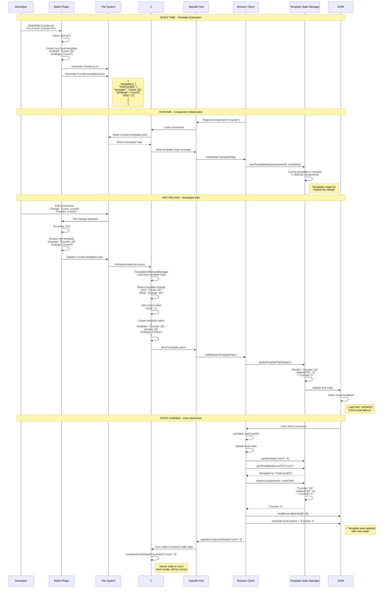
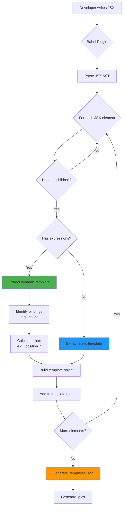
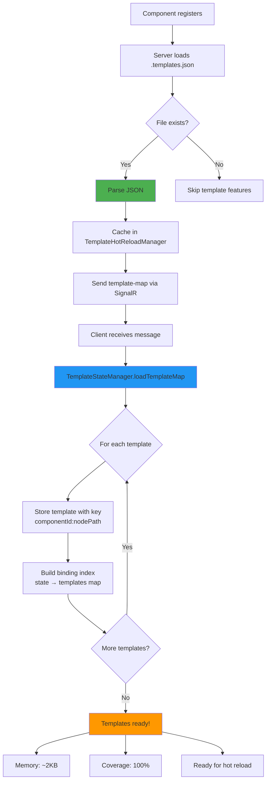
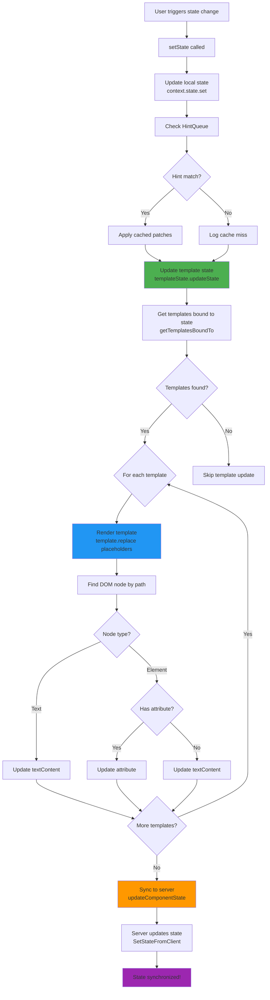
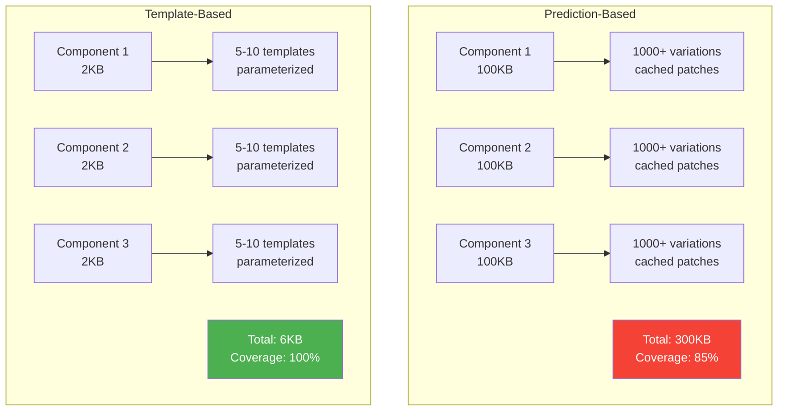
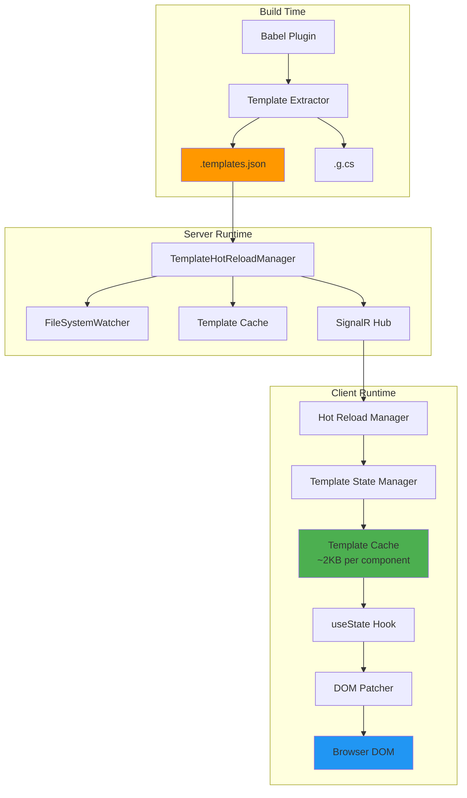
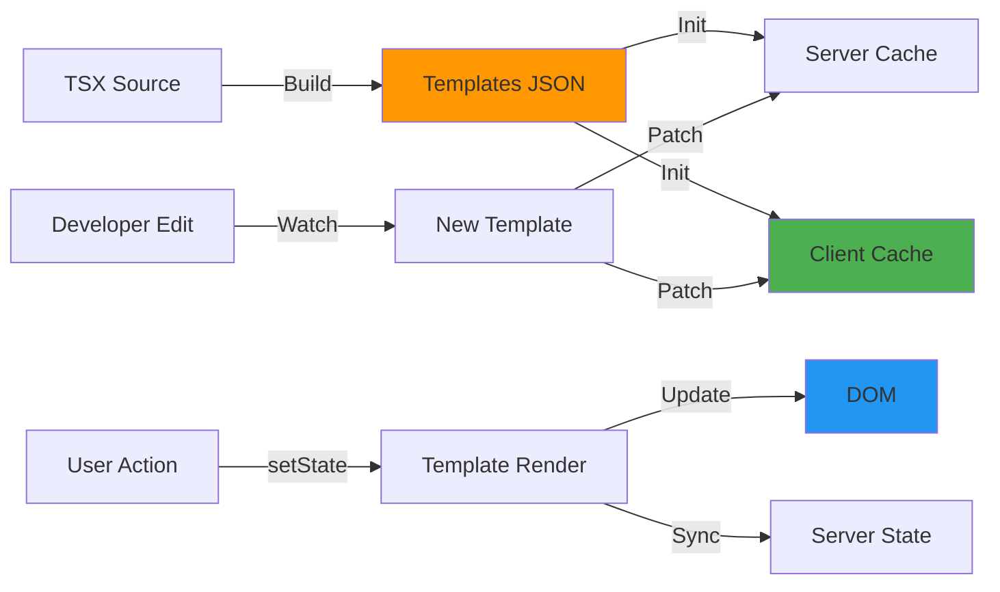
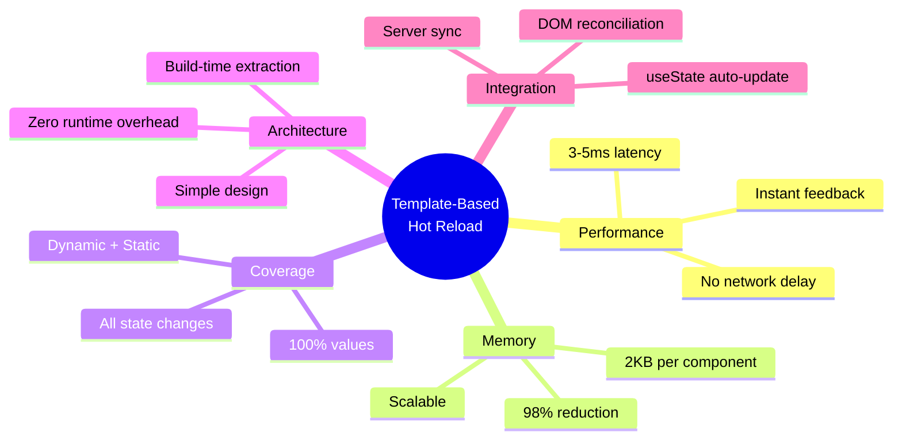

# Minimact Hot Reload Flow - Template-Based Architecture

## Complete System Flow



## Detailed Component Flow Diagrams

### 1. Template Extraction (Build Time)



### 2. Template Loading (Runtime Init)



### 3. Hot Reload Update (Template Patch)

```mermaid
flowchart TD
    A[Developer edits TSX] --> B[FileSystemWatcher detects]
    B --> C[Babel re-runs]
    C --> D[New .templates.json generated]
    D --> E[Server loads new map]
    E --> F{Compare with cached map}

    F --> G{Template changed?}
    G -->|Yes| H[Get current component state]
    G -->|No| I[Skip - no update needed]

    H --> J[Fill template with params<br/>template: Counter: {0}<br/>params: [5]<br/>= Counter: 5]
    J --> K[Create TemplatePatch object]
    K --> L[Send via SignalR]
    L --> M[Client receives patch]
    M --> N[Render template with params]
    N --> O[Find DOM node by path]
    O --> P{Node found?}

    P -->|Yes| Q[Update textContent]
    P -->|No| R[Log warning]

    Q --> S[Flash visual feedback]
    S --> T[Update cached template]
    T --> U[Complete! 3-5ms total]

    style H fill:#4CAF50
    style N fill:#2196F3
    style U fill:#FF9800
```

### 4. State Change (useState Integration)



## Memory Comparison



## Performance Timeline

```mermaid
gantt
    title Hot Reload Performance Timeline
    dateFormat X
    axisFormat %Lms

    section Prediction-Based
    File change detected     :0, 1ms
    Load from cache          :1ms, 2ms
    Apply patches            :3ms, 2ms
    Total (if cached)        :0ms, 5ms

    section Template-Based
    File change detected     :6ms, 1ms
    Render template          :7ms, 1ms
    Find DOM element         :8ms, 1ms
    Update DOM               :9ms, 1ms
    Visual feedback          :10ms, 1ms
    Total                    :6ms, 5ms
```

## Architecture Layers



## Data Flow Summary



## Key Benefits Visualization



---

## Legend

- 🟢 **Green**: Template/state operations
- 🔵 **Blue**: Rendering operations
- 🟠 **Orange**: File I/O operations
- 🟣 **Purple**: Synchronization operations
- ⚡ **Lightning**: Instant/Fast operations (<5ms)
- 📦 **Package**: Cached data
- 🚀 **Rocket**: Performance optimization
